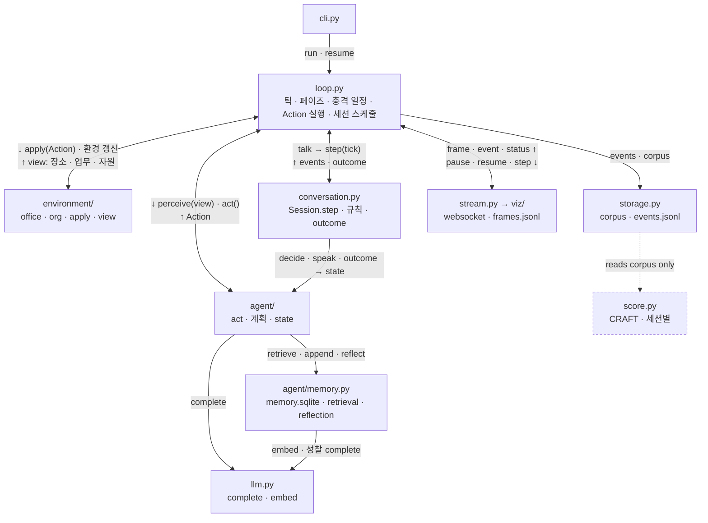
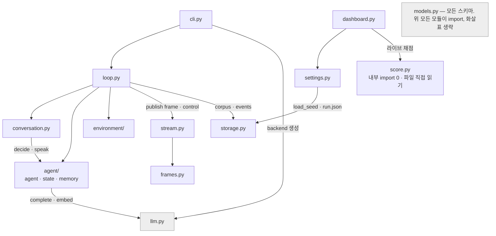

Conflict Dynamics · 엔진 시뮬레이션 구현 설계

# 회사 월드 시뮬레이션 확장 계획

**초안** 2026-09-15 · **개정** 2026-09-16 — 코드 대조 · 표출 감정 · 페르소나 원칙 · 3단계 순서 · 브랜치 · 틱 흐름 · 과설계 감사 반영 · 턴/락/블로킹 · DM 두 상태 · 객체 경계 · **기준 커밋** `76d6e9e` · **담당** 환경 트랙 · 페르소나 트랙(고서연)

| 결정 | 값 | 비고 |
|---|---|---|
| 순서 | **엔진 → 시각화 → 페르소나** [개정 2026-09-19] | A 회사 시뮬레이션 엔진(+실 API 준비) → B Phaser 시각화 → C 20명 페르소나 실험. 시작 전 현재 `master`를 `wiki` 브랜치로 보존(§0-6). |
| 언어 | **English** | 공개 발화·성찰·메모리 레코드 모두 영어. 문서·UI만 한국어. CRAFT·CGA·임베딩을 그대로 쓴다. |
| 측정 | **CRAFT, 세션 단위** | 대화 세션(회의·잡담·1:1·DM) 하나 = ConvoKit conversation 하나. 세션마다 p(t) 시리즈. ConvAbuse·CAD는 제외. |
| 페르소나 | **system 배치, 합리적** | `persona_placement: system`을 기본값으로. 비합리 성향은 일부러 부여하지 않는다 — 갈등은 구조(제로섬·희소 자원·의존 실패)에서 나와야 한다. |

범례 — [가능] 현재 구조 위에 추가만 하면 됨 · [코드 변경] 기존 코드가 막고 있음, §4 참조 · [신규] 아직 아무것도 없음 · [개정] 초안에서 서술을 고친 항목 · **A / B / C** 엔진 / 페르소나 테스트 / 시각화 단계

## 0. 현재 상태

### 0-1 1차 구현 — 위키 포맷 토론 환경

한 틱 = `대화 읽기 → urge(0~1) 결정 + 성찰 저장 → 게이트 통과 시 발화`. 새 글이 없는 에이전트는 직전 판단을 재사용한다(`pending` 재시도, `engine.py:127`).

| 발언 정책 | 실제 동작 (`engine.py`) |
|---|---|
| `round_robin` | 매 틱 설정 순서로 전원 순회. 게이트 통과자는 **전원** 게시. 턴제 아님. |
| `random` | 위와 같되 순서만 매 틱 셔플. |
| `bidding` | 최고 urge 에이전트 1명(동점 랜덤) × availability = 게시 확률. 틱당 최대 1명. |
| `event_driven` | 답글·@호명·보류 판단이 있을 때만 판단. 처음 읽는 에이전트는 무조건 판단. |

| 성찰 모드 | 프롬프트에 들어가는 것 |
|---|---|
| `none` | 없음. 기록만. |
| `summary` (기본) | LLM이 **누적 작성한** 최신 성찰 1개. "직전 관측 1개"가 아니다 — 지시문이 "must stand on its own as a cumulative memory"를 요구한다. |
| `full` | 지금까지의 성찰 전체. |

성찰과 별도로 공개 발화는 `context_size` 창(기본 10)으로 들어가며, 읽지 않은 발화는 절대 버리지 않는다(`agent.py:48`). 즉 현재 메모리는 **발화 창 + 성찰 리스트** 두 채널이다. 종료 조건은 `max_ticks` · `max_utterances` · `silence`.

### 0-2 실험 결과 [개정]

초안의 "12틱 × 1회, 갈등 없음"은 이후 세 실험으로 대체됐다. 모두 실제 OpenAI 호출 + CRAFT, 조건당 3회.

| 실험 (2026-09-15) | 조건 | 인신공격 | 관찰 |
|---|---|---|---|
| 조건부 방어적 페르소나 | Alex에 조건부 방어 성향 | 0 / 3 | 대조군도 0/3. 상대가 논점을 인정하면 진정 조건이 더 자주 충족. |
| 비합리적 페르소나 | Alex에 무조건 적대 귀인·증거 무시 | 0 / 3 | 모델이 **페르소나를 명시적으로 기각**. 성찰에 "not evidence of a coordinated effort" 등 페르소나 문장의 직접 부정. urge 1~2회 게시 후 0.2 이하. |
| 페르소나 배치 | 같은 페르소나를 `persona_placement: system` | **5건 / 2 of 3** | 동기 귀속형 공격("a determination to bury"). 욕설·능력 비하 없음. CRAFT max 0.443 < 임계 0.571. 다른 5명이 되받지 않아 한 방향 긴장. |

> **갱신된 진단**
>
> 갈등 부재의 원인은 "에이전트가 이성적이어서"가 아니다. 페르소나가 사용자 메시지의 JSON 필드로만 전달되어, 시스템 프롬프트의 갱신 지시(`DECIDE_INSTRUCTIONS`: "revise earlier impressions", "Prior impressions can be mistaken", "Silence is a valid default")에 밀렸다. **배치가 페르소나 유지 여부를, 페르소나 내용이 유지된 성향의 표현을 결정**한다. 남은 문제는 되받기(보복)가 없어 CRAFT 임계에 못 미친다는 것.
>
> 비합리 페르소나는 "이 모델·이 프롬프트에서 공격이 나올 수 있는가"를 확인한 **진단 도구**다. 회사 도메인의 설계 목표가 아니며, 이후에는 양성 대조(positive control)로만 남긴다.

### 0-3 열린 논의사항 [개정]

1. **합리적 페르소나 + system 배치에서 격화가 나오는가** — baseline-system(기존 6명, system 배치)은 공격 0건이었다. 비합리 성향 없이 메모리 편향(§2)·구조적 장치(§1-8)만으로 되받기와 CRAFT 임계 초과를 만드는 것이 본 연구의 질문이다. 비합리 페르소나 계열(보복 조건 등)은 보류.
2. **갱신 지시 제거 변형** — `persona_placement: system` 고정 + "Prior impressions can be mistaken" 제거. 메모리 작업(§2)의 전제이기도 하다.
3. **발언 순서** — bidding 단독이 아니라 컨텍스트별 혼합(§1-15).

### 0-4 선행연구

- 메인 1: Generative Agents(Smallville), AgentSociety, OASIS, MiroFish
- 메인 2: **Smallville**, **ConvoKit**
- 측정: CRAFT (EMNLP 2019). ConvAbuse·CAD는 데이터셋이라 별도 학습이 필요하고 도메인(챗봇·Reddit)이 달라 제외.

### 0-5 트랙 분담

| 트랙 | 담당 | 범위 |
|---|---|---|
| 환경 (회사 도메인) | 본인 | 출근 → 업무(+식사·휴식) → 퇴근 |
| 에이전트 페르소나 20명 | 고서연 | 내부: DISC 행동 유형(통계 반영) / 외부: 직급, 취미 +α |

페르소나 트랙 조사 항목: ① 20명 Persona Table (DISC × 직급 × 직무 × 부서 × 취미) ② Organization Chart ③ Job / Authority Table ④ Work Flow ⑤ Interaction / Conflict Event List.

### 0-6 브랜치 전략 [신규]

위키 토론 시뮬레이터로 돌아와 그 방향의 추가 연구를 할 가능성을 남긴다. 작업 시작 전에 현재 `master`(`76d6e9e`)를 `wiki` 브랜치로 보존하고, 회사 시뮬레이션은 `master`에서 이어간다. 저장소의 기본 브랜치 이름은 `main`이 아니라 `master`다.

```text
git switch master
git tag wiki-fork                 # 분기점. 실험 보고서의 "실행 기준 코드"로 인용
git branch wiki                   # 현재 HEAD 그대로
git push origin wiki wiki-fork
# 이후 회사 시뮬레이션 커밋은 전부 master
```

| 브랜치 | 용도 | 규칙 |
|---|---|---|
| `wiki` | 위키 토론 방향 추가 연구 | 평면 모듈 구조 유지. 프롬프트 변형·프리셋·실험 보고서는 여기서. §5의 패키지 재편은 적용하지 않는다. |
| `master` | 회사 시뮬레이션 (A → B 시각화 → C 페르소나 테스트) | §5 구조로 재편. 위키 프리셋은 `conversation.run()` 래퍼로 회귀 테스트만 남긴다. |

- **공유 개선은 `master`에서 만들고 `wiki`로 cherry-pick** — LLM 캐시, `embed`, 세션별 채점처럼 양쪽에 유용한 것. 파일 경로가 갈리므로 merge 대신 cherry-pick + 수동 조정.
- `wiki` → `master` 방향 merge는 하지 않는다. 위키 쪽 실험 결과가 회사 설계에 영향을 주면 계획 문서로 반영한다.
- `wiki` 브랜치는 "그 시점 그대로 재현" 보장, `master`의 위키 회귀 테스트는 "새 엔진이 옛 결과를 재현" 보장. 역할이 다르므로 둘 다 유지한다.
- 실험 보고서의 "실행 기준 코드 ``" 관례는 양쪽 모두 유지. `runs/`는 gitignore라 브랜치와 무관 — 어느 브랜치의 실행인지 `run.json`의 `simulator_version`에 브랜치명을 넣는다.

## 1. 구현 기능 목록

### 1-1 틱 엔진 / 스케줄러 [코드 변경] **A**

- [ ] **틱 재정의** — "대화 1턴" → 시뮬레이션 시간 **15분**. 하루 32틱. `Utterance.timestamp`는 정수 틱이고 같은 틱의 복수 발화를 이미 허용하므로 데이터 모델은 그대로. Smallville의 step은 게임 시간 10초(`sec_per_step`)지만 그것은 타일 이동용이고 LLM 계획 분해 단위는 5~15분 — 우리 틱은 그 층에 맞추고 이동은 Phaser tween이 맡는다. 15분 틱에서 사무실 안 이동은 0틱.
- [ ] 하루 페이즈: 출근 → 오전 업무 → 점심 → 오후 업무 → 퇴근 → (야근). 페이즈·캘린더·외부 충격 일정은 `loop.py` 소관.
- [ ] 틱 루프: `환경 갱신 → view 생성 → agent.act() → Action 적용(environment, talk은 세션) → 성찰 기록 → 로깅`. 흐름은 §5-2·§5-4.
- [ ] 다일 캘린더 — day, 마감·정기회의는 시나리오 YAML의 고정 일정
- [ ] 종료 조건 — `max_days`만. "갈등 해소/교착" 같은 조건은 엔진이 갈등을 판정해야 하므로 생성·측정 분리(§3)에 어긋나 넣지 않는다. `score.py:151`의 stop_reason 화이트리스트에 `max_days` 추가.

막는 것: `engine.run()`이 틱 루프·rng·pending·silence를 전부 함수 내부에 소유. 월드 루프가 세션을 틱 단위로 호출하려면 `Session.step(tick)`으로 제어 역전 필요(§4-3).

### 1-2 환경 — 물리 [신규] **A**

1-2와 1-3은 하나의 패키지 `environment/`(`office.py` · `org.py`)다. 둘 다 루프가 Action을 적용하는 같은 상태이고 에이전트는 둘 다 `view`로만 본다. 설정 조합성(같은 사무실 × 다른 조직도)은 Hydra 설정 그룹 `conf/environment/office/`·`conf/environment/org/`가 맡는다.

- [ ] 장소 그래프 — 자리, 부서 사무실, 회의실, 탕비실, 식당, 로비. 엔진은 `place_id`만 안다. 타일 좌표는 Tiled 맵(B)에만 있고 `frames.py`가 매핑한다.
- [ ] 장소별 허용 행동 / 수용 인원 (회의실 예약 충돌 = 자원 갈등 소스)
- [ ] 공동 재실(co-presence) — 같은 장소끼리만 잡담·우연 대화
- [ ] 자원 풀 — 회의실·장비(office), 예산·인력(org). **희소하게** — 시나리오 YAML이 정한다.
- [ ] 외부 충격 — 긴급 요청, 클라이언트 클레임, 인력 이탈, 마감 단축. 확률이 아니라 **시나리오 YAML의 고정 (day, tick) 일정**. 재현성.

### 1-3 환경 — 조직 [신규] [코드 변경] **A**

- [ ] 부서 / 직급 / 직무 스키마, 조직도 — 보고 관계 + cross-functional
- [ ] 권한 테이블 — 할당·승인·거부·평가. `Environment.apply`가 Action마다 검사하는 유일한 지점.
- [ ] 평가·인센티브 — KPI, 승진 슬롯(**제로섬**). 1일 실행엔 발생하지 않으므로 **C**.

막는 것: 에이전트 수 상한 6 (`models.py:44`, `settings.py:188`).

### 1-4 에이전트 모델 [가능] **A**

- [ ] 정적 페르소나 — DISC, 직급, 직무, 부서, 취미, 말투. **system 프롬프트에 배치**(배치 실험 결과). DISC는 행동 스타일이지 비합리성이 아니다 — 모든 에이전트는 자기 이해관계 안에서 합리적으로 움직인다. `AgentSpec`에 필드 추가. 설정 편집기는 위키 프리셋 전용으로 동결하고 회사 시나리오는 YAML로만 쓴다.
- [ ] **내부 상태 2개** — `stress`(0~1), `mood`(−1~1). 갱신·소비는 §2-6 표. 피로·업무 부하·만족도는 두지 않는다 — 부하는 Task 잔여량의 함수라 `view`가 계산하고, 나머지는 소비자가 없다.
- [ ] **표출 감정(expression)** — 내부 상태와 별개로 지금 겉으로 보이는 얼굴. 이모지 라벨 집합. 관찰자와 같은 장소의 에이전트가 본다. → §1-16
- [ ] 개인 목표 — 승진, 정시퇴근, 평판, 프로젝트 소유권. 페르소나 문장으로. **C**.
- [ ] 관계 — 쌍별 방향성 스칼라 `relation(a→b)` −1~1 + 미해결 불만 목록 + 요약 텍스트 (§2-3e)
- [ ] 메모리 → §2
- [ ] 인지 필터 — 부분 관측 (`view`)

### 1-5 업무(Task) 시스템 [신규] **A → C**

- [ ] Task 스키마 — 난이도, 소요 틱, 마감, 필요 스킬, 담당자, 선행 의존, 품질. `models.py`.
- [ ] **생성원 2층** — 시나리오 YAML이 **최종 목표 + 마감 + 평가 기준**을 고정하고, 하위 Task는 **관리자 에이전트의 LLM**이 `plan`/`assign` Action으로 생성. 출근 페이즈에 하루 1회 + 외부 충격 시 재생성.
- [ ] **A에서는** 데모 백엔드가 의미 있는 Task를 만들 수 없으므로 시나리오 YAML의 **정적 하위 Task 목록**으로 돌린다. LLM 생성과 검증(의존 DAG 순환 금지, 최종 마감 초과 거부, 담당자 권한)은 **C**에서. 생성 결과는 `task_created` 이벤트.
- [ ] 분담 → 수행 → 협업(의존 대기) → 평가 → 피드백. 분담은 시나리오가 열어둔다 — 관리자 페르소나(DISC)가 누구에게 몰아주는지가 갈등 트리거. 불공정 분담은 설계가 아니라 결과여야 한다.
- [ ] 의존 실패 — A 지연 → B 대기 → 책임 소재 **(핵심 갈등 트리거)**. 대기 중 B가 무엇을 하는지 정의하지 않으면 idle 루프에 빠진다:
  - `view.blocked = [{task, owner, since_tick, due}]`. "N틱째 대기"가 보이면 계획 항목이 이행 불가 → **예상 밖 관측**으로 취급 → reaction LLM 호출(§1-17 3단계).
  - 선택지는 이미 Action 집합에 있다 — 대안 Task `work`, 담당자에게 `message`/`talk`(독촉), 관리자에게 `report`(에스컬레이션), `rest`. LLM이 고른다. 독촉 vs 보고 vs 참기를 DISC가 가르고, 그 차이가 갈등 경로의 차이가 된다.
  - 독촉 `message`가 `no_reply_ticks`째 무응답이면 요청자 `view`에 표시 → 두 번째 reaction. "ignored" 레코드는 C지만 view 신호는 A.
  - 데모 백엔드 규칙: blocked ≥ 2틱 → owner에게 message, ≥ 4틱 → manager에게 report. 하루 데모에서 이 경로가 실제로 돌아야 한다.
- [ ] 야근 조건 — 잔여 업무량 > 남은 근무 시간. 규칙이지 파라미터가 아니다.

### 1-6 행동(Action) 시스템 [코드 변경] **A**

- [ ] 행동 스키마 — `move`, `work`, `rest`, `eat`, `talk`(재실 대화), `message`(DM 1건), `chat`(DM 실시간 전환), `assign`, `request`, `approve/reject`, `report`. `complain`·`gossip`(비공개 세션)은 **C**.
- [ ] **Action은 LLM 출력이다.** 별도 효용 선택기·비용표·전제조건 모듈을 두지 않는다. 유효성(권한 · 장소 · 수용 인원)은 `Environment.apply` 한 곳에서 검사하고, 거부되면 그 사실이 `view`로 돌아간다.
- [ ] 모든 행동 출력에 `expression` 동반 — 행동과 함께 얼굴이 바뀐다 (§1-16)
- [ ] availability 게이트 재사용

막는 것: `Decision`이 urge/reply_to/reflection 3필드 고정(strict + forbid). 프롬프트에 "Wikipedia talk-page", "editor" 하드코딩. 새 스키마 + 프롬프트 계층 교체 + `PROMPT_VERSION` bump.

### 1-7 대화 서브엔진 — 기존 위키 엔진 모듈화 [코드 변경] **A**

- [ ] 현 토론 엔진(`engine.py`)을 `conversation.py`의 **"대화 세션" 객체**로. 파일 하나 — 규칙 12줄, 지시문 상수, outcome 소비자 1개를 쪼갤 이유가 없다.
- [ ] **A의 세션 2종** — `talk`(같은 장소 재실, `event_driven`) · `message`(DM, 아래 두 상태). 회의 턴제, 비공개 채널(뒷담화), DM 무응답 → "ignored" 레코드는 **C**.
- [ ] **한 에이전트 = 한 틱에 한 세션.** 세션 중 도착한 메시지는 큐에 쌓여 종료 후 `view`에 unread로 나타난다.
- [ ] **틱 안의 턴 수** — `Session.step(tick)`은 기존 규칙(전원 판단 → 게이트 → 게시)을 `turns_per_tick`번 반복한다. 위키 엔진처럼 틱당 발화 1개면 6문장 언쟁에 90분이 걸려 시간 감각이 어긋난다. 참여자는 그 틱 내내 세션 안이므로(위 규칙) "다른 사람은 15분 일하고 이들은 15분 대화"로 맞는다. 기존 `last_seen`·`pending` 로직이 내부 라운드에 그대로 대응 — 새 글 없으면 재판단하지 않는다. `Utterance.timestamp`는 틱 그대로(같은 틱 복수 발화 허용), CRAFT 영향 없음. 값은 아래 표.
- [ ] **outcome hook** — 세션 종료 시 관계·내부 상태·Task에 반영. 현재 가장 크게 빠진 연결 고리. 산정 방식은 아래.
- [ ] **세션 = ConvoKit conversation 1개** — 측정 단위(§3)와 저장 단위(§1-11)를 세션에 맞춘다.

| 세션 | `turns_per_tick` | 수명 |
|---|---|---|
| `talk` 잡담 · 우연 대화 | 12 | silence 2틱 or 페이즈 종료(점심 끝, 퇴근) |
| `message` live 상태 | 12 | 한 라운드 게이트 미통과면 async로 복귀 |
| `message` async 상태 | — (act당 1건) | 쌍당 하루 1 thread. 답 없어도 유지 |
| 회의 (C) | 16 | 안건 길이 = 시나리오가 지정한 틱 수 |

#### message — DM thread의 두 상태

"비동기 세션에 bidding"은 모순이었다. 틱당 12턴이면 동기 채팅이고, 동시에 "답이 없어도 유지"라는 비동기 성질도 있어야 한다. 그래서 **쌍당 하루 하나의 DM thread**(= ConvoKit conversation 1개, 세션 id `dm:A:B:day`)가 두 상태를 오간다.

| 상태 | 발화가 생기는 곳 | 다른 일과의 관계 | 전환 |
|---|---|---|---|
| **async** (기본) | `act()`가 `message(to, text)`를 반환하면 thread에 1건 append. `Session.step`은 돌지 않는다. | 보낸 쪽은 그 틱을 메시지에 쓴 것(Action 1개). 받는 쪽은 **다음 틱** `view.unread`에서 본다 — 같은 틱 배달은 판단 병렬화(§1-10)와 충돌. | 받는 쪽 act()가 `chat(with=A)`를 고르고 A가 세션 중이 아니면 → 그 틱부터 live |
| **live** | 같은 thread 위에서 `Session.step(tick)`이 `talk`처럼 `bidding` × 12턴 | 둘 다 "1틱 1세션" 적용 — 다른 세션·업무 못 함. 원격이라 co-presence 불필요, 비공개라 재실 타인은 텍스트를 못 본다(expression은 본다). | 한 라운드에서 아무도 게이트를 못 넘으면 → async로 복귀. 페이즈 종료도 복귀. |

- 수신자 선택지(reaction, 다음 틱): `message`로 1건 답장(async 유지) · `chat`으로 실시간 전환 · 무시. DISC가 가른다 — 고 D는 바로 chat, 고 C는 message 1건.
- 무시: async에서 `no_reply_ticks`째 답이 없으면 발신자 `view`에 표시(§1-5). "ignored" 레코드는 C.
- 세션 중인 사람에게 온 메시지는 큐에 남아 세션 종료 후 unread. `chat` 요청도 상대가 세션 중이면 async 답장으로 처리된다.
- CRAFT는 thread 전체를 하루 단위 conversation으로 채점. live 구간은 `event: session_live {start, end}`로 남겨 구간별로도 볼 수 있다.
- 그룹 DM·채널은 **C**.

막는 것: 시드 정확히 2개·timestamp 0 강제(`storage.py:23,30`), 빈 스레드 거부(`engine.py:47`), 단일 루트(`models.py:83`). 세션은 첫 발화자의 발화(또는 메시지)를 루트로 시작한다.

#### outcome hook 산정 — 규칙 기반, 추가 호출 0

세션이 끝나면 `relation(a→b)`, `grievances`, `stress`·`mood`, Task 상태를 갱신한다. LLM 판정(세션 끝 추가 호출)은 쓰지 않는다 — 호출 ↑, "착하게" 평가하는 편향, 비결정적. 대신 발화 레코드에 이미 있는 `valence`(§2-3a, `decide` JSON 동봉)를 내 관점에서 집계하고 구조 사실(거부 · 무시 · 편들기 · 공개)을 더한다.

```text
relation(a→b) += w_v · mean valence(b→a 발화)                 # 부정이면 내려간다
               − w_s · [b가 a의 요청 거부 or 무시]
               × (public ? 1.5 : 1)                             # 공개 석상 배율
grievance     += (a의 요청 거부 or 공개 반박) and 미해소 → reflection id 참조
stress(a)     += w_a · Σ arousal(a가 받은 발화) + w_s · [요청 거부]   # 매 틱 −ρ 회복
mood(a)        = mean valence(a의 최근 M틱 레코드)                 # 세션 밖에서도 갱신
Task          ← 승인/거부 결과 그대로 (연장 거부 → 마감 유지 → 야근)
```

가중치 4개(`w_v · w_s · w_a · ρ`)와 창 `M`은 §2-6 표의 기본값으로 고정한다. 조건당 3회로는 ablation이 불가능하므로 실험 변수로 두지 않는다.

예 — 회의에서 A가 마감 연장 요청, B가 공개 거절, C가 B 편: relation(A→B) ↓ ×1.5, grievance "refused extension in front of team", relation(A→C) 소폭 ↓, stress(A) ↑ → expression `annoyed`, relation(B→A) 소폭 ↓, Task 마감 유지.

hook은 갱신과 함께 `event: outcome {a, b, relation_delta, grievance?}`를 남긴다 — 이벤트 로그와 라이브 화면(§1-13)이 같은 레코드를 쓴다.

### 1-8 갈등 모델 [개정]

- [ ] 사건 목록 — 자원 경쟁, 책임 전가, 권한 침해, 공개 비판, 평가 불만, 마감 압박, 약속 위반. 코드가 아니라 **시나리오 설계 체크리스트**(§2-6 D). 소문 전파는 B.
- [ ] 갈등 상태 머신(잠재 → 표출 → 격화 → 교착)은 두지 않는다 — 엔진이 갈등 단계를 판정하는 순간 "시뮬레이션은 자신이 얼마나 갈등적인지 모른다"(§3)가 깨진다. 단계는 CRAFT 시리즈와 이벤트 로그에서 사후에 읽는다.
- [ ] 측정 → §3. 발화 수준은 CRAFT 세션 단위. 관계·조직 수준 내부 변수는 **manipulation check**이지 결과 지표가 아니다.
- [ ] **격화 유도 장치**
  - 제로섬 보상 (승진 1자리, 고정 예산) — B
  - 이해관계를 페르소나에 명시 ("이 프로젝트는 내 성과")
  - 정보 비대칭 + 부분 관측
  - `stress` → 프롬프트 주입 (스트레스 ↑ → 공격성 임계 ↓)
  - 체면/지위 손실 비용 — 공개 석상 배율
  - **페르소나 유지** — system 배치 + 판단 지시문의 갱신 유도 완화. 위 장치들은 페르소나가 유지될 때만 작동한다. 배치 실험이 보여준 선행조건.

> **원칙**
>
> **갈등의 원천은 구조, 페르소나는 스타일.** 에이전트에게 "증거를 무시하라", "상대를 악의로 해석하라" 같은 비합리 성향을 부여하지 않는다. 대신 제로섬 보상·희소 자원·의존 실패·정보 비대칭이 합리적 에이전트를 충돌시키고, 메모리 편향(§2-3b)과 표출 감정(§1-16)이 그 충돌을 누적시킨다. 이 원칙이 깨지면 "갈등이 났다"가 아니라 "갈등을 시켰다"가 된다. 비합리 페르소나 프리셋(`gpt-luna-irrational*`)은 측정 파이프라인이 공격을 잡아내는지 확인하는 양성 대조로만 쓴다.

### 1-9 개입(Intervention) [신규] **C**

- [ ] 유형 — 중재자 투입, 상사 조정, 규칙 변경, 업무 재분배, 분리 배치. 각각 시나리오 YAML의 **고정 (day, tick) 이벤트**로 기술 — 외부 충격과 같은 메커니즘, 별도 모듈 없음.
- [ ] "갈등 단계별 조건부 발동"은 두지 않는다 — 엔진이 갈등을 감지해야 하므로 §1-8과 같은 이유. 발동 조건은 구조 사건(`deadline_missed` 등)까지만.
- [ ] 개입 유무 비교 = 같은 시나리오에서 이벤트 한 줄 있고 없고. 별도 러너 없음.
- [ ] 개입 시점은 이벤트 로그에 남으므로 개입 전후 `p(t)` 변화량(설계문서 RQ3)은 채점에서 산출.

### 1-10 실험 / 재현성 인프라 [코드 변경] **A-8**

- [x] YAML 시나리오 정의 — Hydra 설정 그룹. `conf/experiments/` 편집기는 위키 프리셋 전용 동결.
- [x] seed 고정, 멀티런 스윕
- [x] **임베딩 캐시** — `embed()` 한정 (`llm.EmbedCache`, 2026-09-19). `complete`는 캐시하지 않는다: temperature 0.8 호출을 캐시하면 "조건당 3회"가 같은 run이 된다. 데모 백엔드는 무료·결정적이라 A에 소비자 없음.
- [x] **체크포인트 / 재개** — 하루 끝마다 `checkpoints/day-N.json`, 예산 초과 → `paused.json`, `resume=true` (2026-09-19). 데모는 예산·실패가 없어 A에 소비자 없음. 단 A에서 `Environment`·`Agent`에 `snapshot()/restore()`를 둬 직렬화만 나중에 붙인다. `cli.py`의 `ProtectOutput.reserve()`가 기존 run 디렉터리 쓰기를 막으므로 resume 경로는 예외 처리 필요. 예산 초과 시 `LLMError → SystemExit` 대신 checkpoint 후 `status: "paused"`.
- [x] **LLM 호출 병렬화** — `Config.workers` 스레드 풀, 판단 병렬 · 적용 순차 (2026-09-19; asyncio 대신 스레드 — OpenAI 클라이언트가 sync). 순차면 하루 300~400 호출 × 3~5초 = 20~30분/일. 조건당 3회 × 시나리오 5개 × 다일이면 못 버틴다. 규칙: **판단은 병렬, 적용은 순차.** 세션 밖 `act()`는 틱 시작 view 기준이라 독립 → `asyncio.gather`. 세션 bidding은 전원 decide → 승자 선택 → speak라 decide만 병렬. 적용은 에이전트 id 정렬 순. 결정성: 에이전트별 rng seed = run seed + id. 쓰기는 §1-11의 큐로 루프만.
- [ ] 로컬 모델 스위치 — 필요해질 때

### 1-11 로깅 & 데이터 스키마 [코드 변경] **A**

- [ ] **이벤트 로그 하나** — `events.jsonl`, 행 = `(tick, day, kind, actor, target?, location?, session?, payload)`. 판단(`decision`), 행동, Task 변화, outcome, 개입이 전부 `kind`다. 기존 `decisions.jsonl`은 위키 래퍼 경로에서만 남는다. 틱별 관계·업무 스냅샷 파일은 두지 않는다 — outcome·task 이벤트에서 파생.
- [ ] **메모리 저장 = `memory.sqlite`** — 레코드 테이블(4축 · subjects · session) + 임베딩 BLOB + **조회 로그**(어떤 판단에 어떤 기억이 들어갔나). 분석은 이 파일을 직접 읽는다. 별도 분석용 sqlite·parquet은 두지 않는다.
- [ ] **쓰기는 루프만, 틱 끝에 일괄.** 에이전트의 레코드·임베딩은 메모리(numpy) 안에 있고 새 레코드는 쓰기 큐에 쌓인다. 틱 종료 시 루프 스레드가 `events.jsonl`·`memory.sqlite`에 한 번에 커밋. 단일 writer라 A-8에서 LLM 호출을 병렬화해도 `database is locked`가 없다. `PRAGMA journal_mode=WAL` + `busy_timeout`은 보험으로 켜두되 의존하지 않는다. 에이전트별 파일 분리는 하지 않는다 — 분석 때 20개를 union해야 한다.
- [ ] 한 run = 한 ConvoKit corpus, conversation 여러 개. `utterance.conversation_id = 세션 루트`, `conversations.json`에 세션 메타(종류, 참여자, 장소, 시작/종료 틱).

막는 것: `_write_corpus`가 단일 루트 가정(`storage.py:65,79`).

### 1-12 분석 & 지표 **C**

- [ ] 세션별 CRAFT 지표 집계 → run 수준 (§3-2)
- [ ] 격화 곡선, 지속 시간 — CRAFT 시리즈에서
- [ ] 관계 네트워크 — `outcome` 이벤트 누적으로 파벌·중심성 (manipulation check)
- [ ] 개입 효과 크기, 시나리오별 임계 초과 세션 비율

### 1-13 시각화 — Phaser [신규] **B**

- [ ] 엔진과 프론트는 **websocket으로 연결**. 엔진 프로세스 안의 `stream.py`가 매 틱 프레임 메시지를 브로드캐스트하고, 같은 메시지를 `runs/…/frames.jsonl`에 append한다. 라이브와 리플레이가 같은 스키마 — 리플레이는 파일을 한 줄씩 재생할 뿐이다.
- [ ] 프레임 스키마 — 틱별 각 에이전트의 `(place, x, y)`·**표출 감정 이모지**·현재 행동·말풍선 텍스트·세션 id. 장소 그래프(§1-2)가 타일 좌표를 갖는다.
- [ ] **Phaser 뷰어** — 타일맵 오피스(Smallville 방식), 에이전트 스프라이트, 스프라이트 위 이모지, 말풍선, 회의실 점유, Task 보드, 관계 변화 표시, 이벤트 타임라인, 에이전트 클릭 → 성찰·관계 패널. 두 모드: **live**(ws 접속, 프레임 도착 즉시 렌더) / **replay**(`frames.jsonl` 로드, 스크럽). 아래 "라이브 화면에서 보이는 것".
- [ ] **제어 채널** — 프론트 → 엔진 `pause · resume · step · speed`. 루프가 틱 사이에 플래그를 읽는다. 데모 백엔드의 `sleep(0.2)` 페이싱을 `speed`로 대체.
- [ ] Streamlit 대시보드는 분석용으로 유지(세션별 CRAFT, 감정 타임라인). 공간 재생은 Phaser.

#### 스택

| 역할 | 선택 | 이유 |
|---|---|---|
| 씬 렌더링 | **Phaser 3** (3.8x/3.9x 안정판) | Tiled JSON 타일맵 네이티브 로드, 스프라이트 애니메이션, 카메라, 틱 간 이동 tween 내장. Smallville 프론트엔드가 같은 조합(Phaser 3 + Tiled + JSON 리플레이)이라 씬 구조를 참고할 수 있다. Phaser 4는 안정화 여부가 불확실하므로 3.x 고정. |
| 맵 제작 | **Tiled** | 오피스 레이아웃을 GUI로 그려 JSON export. 장소별 오브젝트 레이어(자리·회의실·탕비실)에 `place_id` 속성을 붙인다. 좌표는 여기에만 있고 엔진(`environment/office.py`)은 `place_id`만 안다 — `frames.py`가 둘을 잇는다. |
| 타일셋·스프라이트 | Kenney (CC0) 또는 LimeZu Modern Interiors (유료) | 자체 제작 불필요. 라이선스 명확. Smallville 에셋은 출처가 섞여 있어 재사용하지 않는다. |
| HUD · 패널 · 말풍선 | **HTML/CSS 오버레이** | 틱 스크럽 바, 성찰·관계 패널, 긴 영어 말풍선은 DOM이 낫다 — 줄바꿈·선택·복사·스크롤. 카메라 역변환으로 스프라이트 위에 배치. |
| 이모지 | Twemoji 스프라이트시트 (CC-BY) | OS별 렌더링 차이 제거. 8종이라 시트가 작다. 초기엔 Phaser Text + 이모지 폰트로 시작해도 된다. |
| 엔진 ↔ 프론트 | **websocket** — Python `websockets`, 브라우저 네이티브 `WebSocket` | 엔진 프로세스 안에서 백그라운드 스레드로 서버를 띄운다. 별도 프로세스·HTTP 프레임워크·Socket.IO 불필요. 나중에 여러 run 관리나 HTTP API가 필요해지면 FastAPI + uvicorn으로 승격. |
| 빌드 | **Vite + TypeScript** | 메시지 스키마를 `messages.d.ts`로 고정 → 엔진 쪽 스키마 변경이 컴파일 에러로 잡힌다. 산출물은 정적 `dist/`. Node는 개발 시에만. |
| 분석 차트 (Streamlit) | Altair | 감정 타임라인(에이전트 × 틱 히트맵), 세션별 CRAFT 곡선. Streamlit 내장 지원. |

#### 고려한 대안

| 라이브러리 | 장점 | 안 고른 이유 |
|---|---|---|
| PixiJS | 가볍고 빠름 | 타일맵·카메라·입력을 직접 구현. 리플레이 뷰어 하나에 엔진 조립 비용이 크다. |
| Excalibur.js | TS 우선, Tiled 플러그인 | 커뮤니티 작고 참고 사례 적음. |
| Kaplay (구 Kaboom) | 코드 짧음 | 타일맵 지원 약함, 프로젝트 안정성. |
| 순수 Canvas 2D | 의존성 0 | 20명 × 격자면 300줄로 되지만 걷기 애니메이션·카메라·실시간까지 가면 엔진을 다시 쓰게 된다. |
| D3 평면도 뷰 | 논문 그림용, 반나절 | 같은 데이터의 세 번째 렌더러. 논문 그림은 Phaser 스크린샷 + Altair 차트로 충분. |

#### 설계 메모

- **틱 ↔ 프레임** — 15분 틱 하나 = 0.3~0.5초 tween. 스크럽 바로 점프할 때는 tween 없이 상태를 직접 세팅.
- **frames 크기** — 20명 × 32틱/일 × 며칠이면 수 MB. 프레임을 얇게 유지하고, 리플레이 로더는 일 단위로 끊어 읽는다.
- **접속 절차** — 프론트가 붙으면 서버가 `hello`(run, 맵, 에이전트 목록) → 지금까지의 `frame` 전부(history) → 이후 라이브. 중간 접속·재접속이 같은 코드 경로.
- **Streamlit** — `live.json` 스냅샷 방식 유지. Streamlit은 ws 클라이언트로 부적합하고, 분석 화면은 틱 단위 갱신이 필요 없다.
- **Smallville 참고 범위** — `generative_agents/environment/frontend_server`의 Phaser 씬 구조와 리플레이 로직만. Django 부분과 에셋은 제외.

#### 메시지 스키마

서버 → 클라이언트 메시지는 JSON 한 줄. `frames.jsonl`의 한 줄과 동일하므로 리플레이 로더는 파일을 읽어 같은 핸들러에 넣는다.

| type | 방향 | 필드 | 시점 |
|---|---|---|---|
| `hello` | → 클라 | `run_id`, `map`(Tiled 파일명), `agents[{id, name, sprite, dept}]`, `tick_minutes`, `config` 요약 | 접속 직후 1회 |
| `frame` | → 클라 | `tick`, `day`, `phase`, `agents[{id, place, x, y, action, expression, bubble?, session?}]`, `sessions[{id, kind, place, participants}]`, `tasks[{id, title, owner, progress, due, blocked_by?, status}]`, `resources[{id, holder?, until?}]` | 매 틱, history 재전송 포함 |
| `event` | → 클라 | `tick`, `kind`(task_assigned · deadline_missed · request_rejected · intervention · **outcome** …), `actors`, `text`. `outcome`은 `{a, b, relation_delta, grievance?}` | 발생 시. 타임라인 마커 · 관계 변화 표시 |
| `inspect` | → 클라 | `agent`, `reflection`(최근 N), `state`(stress · mood), `relationships[{to, relation, summary}]`, `retrieved`(마지막 판단에 들어간 기억 id) | `control: inspect` 응답 |
| `status` | → 클라 | `state`(running · paused · completed · failed), `message`, `llm_usage` | 변경 시 |
| `control` | 클라 → | `cmd`(pause · resume · step · speed · inspect), `value?`, `agent?` | 사용자 조작 |

성찰·관계 본문은 프레임에 넣지 않는다. 클릭 시 `control: {cmd: "inspect", agent}`로 요청해 `inspect` 메시지로 받고, 리플레이에서는 같은 내용을 `events.jsonl`·`memory.sqlite`에서 읽는다. `tasks`·`resources`는 틱마다 바뀌는 것만 싣는다(전체 목록은 `hello`). 프레임을 얇게 유지해야 20명 × 다일에서도 스크럽이 가볍다.

#### 라이브 화면에서 보이는 것

| 화면 요소 | 내용 | 출처 |
|---|---|---|
| 지도 | Tiled 오피스. 회의실 점유자 이름표, 예약 종료 틱 | `hello.map`, `frame.resources` |
| 스프라이트 | 위치(틱 사이 tween) · 행동 아이콘 · **표출 감정 이모지** · 말풍선 · 같은 세션끼리 묶음 표시 | `frame.agents`, `frame.sessions` |
| 관계 표시 | `outcome` 이벤트 순간 두 스프라이트 사이 짧은 선 — 빨강(relation ↓) · 초록(↑). 몇 틱 뒤 사라짐 | `event: outcome` |
| HUD 상단 | day · tick · phase · 진행 상태 · LLM 토큰 · pause/step/speed | `frame`, `status`, `control` |
| HUD 우측 — Task 보드 | 담당별 진척 바, 마감 D-, blocked_by 표시, 마감 초과 강조 | `frame.tasks` |
| HUD 하단 — 타임라인 | 틱 스크럽 + 이벤트 마커(task · deadline · rejected · outcome · intervention) | `event` |
| 클릭 패널 | 선택 에이전트의 최근 성찰 · stress · mood · 관계 목록(relation/summary) · 마지막 판단에 들어간 기억 | `inspect` |

보이지 않는 것 — CRAFT p(t). 채점은 corpus를 읽는 별도 프로세스라 Phaser에 없고, Streamlit의 라이브 채점(`live.json`)이 유일하다. 시각화에 점수를 넣으면 관찰자가 점수를 보며 개입하게 되어 생성·측정 분리가 흐려진다.

### 1-14 전체 계획 — 3단계 [개정]

```text
A. 회사 시뮬레이션 엔진 — 구조 변경은 세 건
   ① engine.run → conversation.Session.step (제어 역전)
   ② loop.py 신설 (틱 · 페이즈 · Action 적용 · 세션 스케줄 · 저장 · 송출)
   ③ environment/ 패키지 (office.py · org.py)
   + agent/ (agent · state · memory), models.py 스키마, llm.py embed(), storage.py 다중 corpus
   파일을 옮기지 않는다: llm.py · storage.py · score.py · cli.py 그대로
   ▶ 마일스톤 A: demo 백엔드로 6명 × 1일(32틱)이 API 없이 끝까지 돌고 corpus + scores.json 산출
   + A-8 실 API 준비: 체크포인트/재개 · 임베딩 캐시 · 판단 병렬화

B. 시각화
   frames.py + stream.py → viz/ Phaser live → replay
   ▶ 마일스톤 B: 실행 중인 run을 라이브로 보고 멈추고, 끝난 run을 재생

C. 페르소나 테스트
   20명 페르소나(고서연) 투입, system 배치, 갱신 지시 완화
   → 관리자 LLM Task 생성 · 회의 턴제 · 비공개 세션 · hearsay
   → 시나리오 3~5개 × 조건당 3회, baseline / α₅ on·off / 개입 유무, 세션별 CRAFT + 수동 라벨
   ▶ 마일스톤 C: "합리적 페르소나 + 구조만으로 격화가 나오는가"에 답하는 보고서
```

**순서 [개정 2026-09-19]** — 시각화를 페르소나 테스트보다 앞당기고 단계 이름을 그에 맞춰 바꿨다: A 엔진(+A-8 실 API
준비: 체크포인트/재개 · 임베딩 캐시 · 병렬화) → **B 시각화** → **C 페르소나 테스트**. 이유: 실 LLM으로 돌린 시뮬레이션이
의도대로 움직이는지(이동 · co-presence · 세션 개시/종료 · 표출 감정 · blocked → 독촉 → 보고 경로)를 **화면으로 먼저
확인**한 뒤에 세부 시나리오(C-15)와 실험(C-16)에 들어간다. B는 선행이 7뿐이라(§6) 의존성상 문제가 없고, 데모 백엔드로
뷰어를 개발하면 API 비용이 0이다. C-13이 엔진에 더하는 것(회의 턴제 · 비공개 세션 · hearsay · 개입 · 충격)은
`event.kind`와 말풍선 종류 추가로 뷰어에 반영한다 — §1-13의 "스키마만 지키면 뷰어는 그대로" 원칙이 그것을 위한 것이다.
20명 맵(`full.yaml`)은 C-14 페르소나가 준비된 뒤에 그린다. 고서연 트랙(C-14)은 순서와 무관하게 병렬.

초안과 다른 점 — 위키 엔진에서 메모리 실험을 먼저 하지 않는다. 메모리(§2)는 엔진의 일부로 A에서 짓고, 비교 실험은 C에서 회사 도메인 위에서 한다. 기존 위키 프리셋은 `conversation.run()` 래퍼로 데모 스모크만 돈다 — 비트 동일 재현은 요구하지 않는다(그건 `wiki` 브랜치의 몫, §0-6). 데모 하루가 돌고 난 뒤 실제로 커진 파일만 쪼갠다.

### 1-15 발언 순서 판단 [개정]

| 세션 | 정책 | 현재 코드 |
|---|---|---|
| 회의 | 턴제 + 발제자 우선 — **C** | 없음. 현재 `round_robin`은 틱당 전원 게시 가능이라 턴제가 아니다. A는 잡담과 같은 `event_driven`으로. |
| 잡담 | `event_driven` (같은 장소 재실 + urge 임계) | 있음. 재실 조건만 추가. |
| DM live · 갈등 국면 | `bidding` | 있음. DM async는 규칙 없음 — `act()`의 Action 1건. |

### 1-16 표출 감정(expression) [신규] **A**

에이전트가 지금 **겉으로 보이는** 감정. 내부 상태(§1-4 스트레스·기분 수치)는 관찰자만 보지만, 표출 감정은 **사용자(대시보드)와 같은 장소의 에이전트**가 본다. 둘을 분리하는 이유 — 회사에서 갈등은 느끼는 것과 보이는 것의 차이에서 자란다. 화를 숨기다 터지는 경로, 상대의 얼굴을 오독하는 경로가 여기서 생긴다.

| 라벨 | 얼굴 | 뜻 | valence |
|---|---|---|---|
| `neutral` | 😐 | 기본. 아무것도 드러내지 않음 | 0 |
| `pleased` | 🙂 | 만족, 동의 | +0.5 |
| `amused` | 😄 | 웃음, 농담 반응 | +0.8 |
| `surprised` | 😮 | 예상 밖 정보 | 0 |
| `tired` | 😩 | 피로, 야근 | −0.3 |
| `anxious` | 😰 | 마감, 평가 압박 | −0.5 |
| `annoyed` | 😒 | 불만, 못마땅. 아직 공개 충돌 아님 | −0.6 |
| `angry` | 😠 | 공개 분노. 체면 비용 발생 | −0.9 |

닫힌 집합 8개. `Literal`로 검증하고 분석에서 범주형으로 쓴다. 이모지는 표시용 매핑일 뿐 저장·프롬프트는 라벨 문자열.

#### 어떻게 정해지나

- LLM이 `decide`/`act` 응답에 `expression` 필드를 함께 돌려준다. 지시문: "the face you show others right now; it may differ from what you feel". 추가 호출 없음.
- 페르소나(DISC)가 **표시 규칙**을 정한다 — 고 C·S는 `annoyed`를 `neutral`로 감추는 경향, 고 D는 그대로 드러냄. 페르소나 문장으로 전달, 강제 규칙 아님.
- 데모 백엔드는 `stress`·`mood` 구간 → 라벨 고정 매핑.

#### 누가 보나

| 관찰자 | 어디서 | 무엇을 |
|---|---|---|
| 사용자 | Streamlit 대시보드 (C) | 이름 옆 이모지, 성찰 패널, 에이전트 × 틱 감정 타임라인 스트립 |
| 사용자 | Phaser (B) | 스프라이트 위 이모지, 말풍선 옆. 프레임 스키마 필드. |
| 다른 에이전트 | 같은 장소 재실 시 `view` | `observation` 레코드 "Blake looks angry after the meeting" (§2-3d). DM 상대는 텍스트만 보고 얼굴은 못 본다 — 재실 타인은 반대로 얼굴만 본다. |

표출 감정은 **비언어 신호 채널**이다. 말은 정중한데 얼굴이 `annoyed`인 상황을 상대가 기억하고, 그 기억이 mood congruence(§2-3b)로 되돌아온다. 오독도 자연히 생긴다 — `tired`를 `annoyed`로 읽는 것은 LLM 관측 요약에 맡긴다.

#### 측정에서의 위치

내부 변수와 같이 manipulation check(§3-3). 단, 발화 없이도 매 틱 기록되므로 CRAFT가 비는 구간(세션 사이)의 긴장을 보는 보조 지표가 된다. 세션별 CRAFT `max_p`와 세션 중 `angry`·`annoyed` 비율의 상관을 보고하면 "얼굴이 말보다 먼저 나빠지는가"를 물을 수 있다.

### 1-17 한 틱의 흐름 [개정]

```text
day d:
  출근      각 에이전트 평면 일일 계획 5~8항목 (LLM 1회) · 관리자 하위 Task (A: YAML 정적 / C: LLM)
  오전 업무  틱 반복
  점심      식당 co-presence → 잡담 세션 확률 ↑
  오후 업무  틱 반복 (+ 외부 충격)
  퇴근/야근  잔여 업무 > 남은 시간이면 야근
  일 마감    망각·압축, 체크포인트, day+1

tick t:
  1. 환경 갱신    캘린더 이벤트 · 외부 충격 · Task 진척과 마감 판정 · 자원 상태
  2. view 조립    루프가 조립: Environment.env_view(장소 · 재실자 id · 내 Task · blocked · 자원)
                  + 재실자 expression(agent.state 읽기) + inbox(unread) + 거부된 Action + 내 stress·mood
  3. agent.act()  계획 + view + retrieval(top-k) → Action + expression + 성찰 + 발화 valence
                  계획대로면 LLM 없이 실행. 예상 밖 관측 시에만 reaction 판정:
                  새 메시지 · 호명 · 계획 항목 이행 불가(view.blocked) · 독촉 무응답 · 외부 충격
  4. Action 적용  Environment.apply — 권한 · 장소 · 수용 인원 검사는 여기 한 곳
                  move → 위치 / work → Task 진척 / assign·request·approve → Task
                  talk·message·chat → apply는 검증만(co-presence 등), 세션 생성·append·live 전환은 루프
  5. 세션 step    살아있는 세션마다 Session.step(t): decide → 게이트 → speak
                  종료 시 session.outcomes() → 루프가 agent.apply_outcome() dispatch (§1-7)
  6. 관측 기록    agent.observe() → 스트림 append — 추가 호출 없음:
                  발화 4축은 decide JSON 동봉, 관측 valence는 expression 표 값 (hearsay는 C)
                  임베딩은 루프가 전 에이전트 신규 텍스트를 모아 embed 1회 → 분배
  7. 성찰 트리거  importance 누적 150 or 특정 인물 negative valence 누적 −30 → reflection (LLM)
  8. 로깅·송출    events.jsonl · memory.sqlite 조회 로그 · frame → ws + frames.jsonl
  9. 제어 확인    pause · step 플래그
```

**LLM 호출 원칙** — Smallville과 같다. 계획대로 움직이는 틱은 호출 0. 호출은 일일 계획 · reaction 판정 · 세션 decide/speak · 성찰에서만. 레코드 평가를 위한 별도 호출은 없다 — 재실자 expression 관측이 매 틱 쌓이므로 거기에 모델을 붙이면 N²건이 된다. 20명 × 32틱이 전부 호출이면 예산이 남지 않는다 — 하루 호출 수를 `usage.json`으로 보고 상한을 정한다.

## 2. 메모리 구조 고도화 — Smallville 기반

현재의 성찰 3모드는 "컨텍스트 주입 정책"이지 메모리 구조가 아니다. 틱이 길어지면 `full`은 `max_input_chars`에 걸리고 `summary`는 중요한 과거를 꺼내지 못한다.

### 2-1 Smallville (Park et al., 2023)의 3층 구조

**Memory Stream** — 모든 경험을 자연어 레코드로 시간순 append. `description`, `creation_time`, `last_access_time`, `importance`, `embedding`.

**Retrieval** — 매 판단마다 현재 상황을 쿼리로 상위 k개만 주입.

```text
score = α_recency · recency + α_importance · importance + α_relevance · relevance

  recency    = 0.995 ^ (마지막 접근 이후 경과 시간)     # 지수 감쇠
  importance = LLM이 1~10으로 평가한 poignancy
  relevance  = cos_sim(embedding(memory), embedding(query))
```

세 항 정규화 후 α = 1 동일 가중.

**Reflection** — 최근 사건의 importance 합이 임계(논문 150, 하루 2~3회)를 넘으면: 최근 100개 조회 → 핵심 질문 3개 생성 → 질문별 재조회 → 근거 인용 통찰 생성 → 통찰도 레코드로 저장(성찰 위의 성찰, 트리).

**Planning** — 하루 개요(5~8덩어리) → 시간 단위 → 5~15분 단위 재귀 분해. 계획도 메모리. 예상 밖 관측 시 reaction 판정 후 재계획. 환경 step은 게임 시간 10초(`sec_per_step`)이나 LLM은 매 step이 아니라 계획·인지·대화·성찰 시점에만 호출. 25명 × 게임 2일 실험. 비용은 논문에 수치가 없고 저자 발언·커뮤니티 추정으로 "수천 달러"(GPT-3.5 시절).

### 2-2 현재 구현과의 갭 [개정]

| 항목 | 현재 | Smallville | 필요성 |
|---|---|---|---|
| 저장 단위 | 성찰 텍스트 + 발화 창(`context_size`) | 관측·발화·행동·계획·성찰 | 회사 도메인은 대화 밖 사건이 대부분 |
| 조회 | 성찰 직전 1개 or 전체 / 발화 최근 N개 | 3항 점수 top-k | 틱 수 늘리면 필수 |
| 중요도 | 없음 | LLM poignancy 1~10 | 사소한 일과 사건 구분 |
| 성찰 발동 | 매 판단 | importance 누적 임계 | 비용 + 자연스러움 |
| 성찰 계층 | 평면 (단, LLM에 누적 작성 지시) | 트리 | **고정관념 형성 = 격화의 핵심** |
| 성찰 갱신 지시 | "revise earlier impressions" | 없음 | 제거하지 않으면 고정관념이 스스로 반박됨 |
| 관측 범위 | 전체 대화 공개 | 시야 내 | 오해·소문의 전제 |
| 임베딩 | 없음 (`LanguageModel`은 `complete`만) | 있음 | relevance 계산 |

### 2-3 갈등 시뮬레이션용 확장 (본 연구의 기여 지점)

#### (a) 레코드 스키마 확장

```text
class MemoryRecord(BaseModel):          # models.py
    id: str
    agent_id: str
    type: Literal["observation", "utterance", "action", "plan", "reflection"]   # hearsay는 B
    description: str                     # English
    created_tick: int                    # last_access는 MemoryStore.last_access{id→tick} — 레코드는 불변
    importance: float                    # 1~10

    # --- 갈등용 확장 ---
    valence: float                       # -1 ~ +1   나에게 좋았나 나빴나
    arousal: float                       # 0 ~ 1     감정적으로 얼마나 격했나
    self_relevance: float                # 0 ~ 1     내 이해관계에 걸린 정도
    subjects: list[str]                  # 등장 인물 id
    session_id: str | None               # 발화·관측이 속한 대화 세션
    # embedding은 memory.sqlite BLOB 컬럼, 모델 필드 아님
```

poignancy 단일 스칼라를 **importance × valence × arousal × self_relevance** 4축으로. 갈등은 "중요한 사건"이 아니라 **"나에게 불리하고 감정이 실린 사건"**에서 발생한다.

**4축은 어디서 오나 — 추가 호출 없음.** 발화·판단 레코드는 `decide`/`act` JSON에 `importance · valence · arousal`을 동봉한다(같은 호출). 관측 레코드는 규칙: `valence` = 관측한 expression의 표 값(§1-16), `arousal` = |valence|, `importance` = 3 고정. `self_relevance`는 모든 타입에서 `[subjects에 내가 포함]` ∨ `[내 Task 관련]`. 작은 모델로 레코드마다 평가하는 안은 버렸다 — 재실자 관측이 매 틱 N²건이라 "계획대로면 호출 0"과 모순.

#### (b) 조회 점수식에 감정 일치 편향 [개정]

```text
score = recency + importance + relevance          # Smallville, 정규화 후 각 1
      + α₅ · mood_congruence                      # sign(mood) == sign(valence) 이면 |valence|, 아니면 0
```

`mood`는 내부 상태(§1-4, §2-6). `α₅` = mood-congruent recall — 기분이 나쁜 에이전트가 그 사람의 **부정적 기억을 우선 조회** → 더 공격적 반응 → 부정적 레코드 축적 → 격화 나선. "현재 상대가 subjects에 있으면 가산"(α₄)은 별도 항으로 두지 않는다 — 쿼리 문장에 상대 이름을 넣으면 relevance가 흡수한다.

> **가설의 위치**
>
> 초안은 "갈등이 없던 이유 = 과거가 중립적으로 조회되기 때문"이라 썼으나 실험은 원인을 페르소나 배치·갱신 지시로 지목했다. `α₅`는 원인 설명이 아니라 **유지된 성향이 상대별로 누적되는 경로**다. 따라서 baseline(합리적 페르소나 + system 배치 + 갱신 지시 완화, §0-3 #2) 위에서 `α₅` on/off를 비교하고, 종속변수는 세션별 CRAFT 임계 초과 여부와 되받기 발생으로 둔다. **이 계획에서 실험 변수는 α₅ 하나다.** 나머지 파라미터는 §2-6의 기본값으로 고정한다.

#### (c) 성찰 트리 → 인물에 대한 고정 신념 [개정]

- **정기 성찰** — importance 누적 임계 (Smallville)
- **관계 성찰** — 특정 인물이 subjects인 레코드의 valence 누적이 **−30**(정기 임계 150의 1/5 척도) 아래로 가면 → "나는 왜 B와 일하는 게 힘든가?" → 근거 인용 → `[reflection] B keeps missing deadlines and deflects responsibility` 저장

2차 성찰은 개별 사건보다 높은 importance로 우선 조회되어 고정관념이 지속된다. 개입 실험의 종속변수를 "성찰 레코드가 갱신/반박되었는가"로 둘 수 있다.

> **선행조건**
>
> `DECIDE_INSTRUCTIONS`의 갱신 유도("Reflection is your updated personal perspective", "Prior impressions can be mistaken")가 남아 있으면 retrieval이 무엇을 꺼내오든 모델이 성찰에서 스스로 반박한다. 비합리 페르소나 실험이 정확히 그 패턴이었다. **성찰 트리는 프롬프트 변형과 한 묶음**이며 `PROMPT_VERSION`을 올린다.

#### (d) 부분 관측 + 소문(hearsay)

- 관측 필터 — 같은 장소 재실 + 세션 참여자만 `observation`
- 재실자의 **표출 감정**(§1-16)도 관측 — 발화 없는 틱에도 "C looked annoyed at her desk" 레코드가 쌓인다. valence는 라벨 표의 값, 호출 없음.
- **C** — A가 B에게 C 얘기 → B의 stream에 `type="hearsay"`. 전달이 LLM 요약을 거치므로 별도 왜곡 로직 없이 소문 변형. credibility 같은 신뢰도 필드는 두지 않는다 — 조회식·프롬프트 어디서도 쓰지 않는다.

#### (e) 관계 캐시

```text
Relationship(a→b) = {            # agent/state.py, 방향성: a→b ≠ b→a
    "relation": float,           # -1~1, 초기 0. outcome hook이 갱신 (§1-7)
    "grievances": list[str],     # 미해결 불만 (reflection id)
    "summary": str | None,       # LLM 생성, 관계 성찰 발동 시에만
    "last_interaction_tick": int,
}
```

trust·affect 두 축으로 나누지 않는다 — 둘 다 같은 valence 합에서 유도되고 §3-2는 하나만 대조한다. 분리는 분석에서 필요해지면. 이 수치는 시뮬레이터 자신의 상태다. 결과 지표로 쓰면 "hook이 내린 값을 hook이 내렸다고 측정"하는 순환이 된다 — manipulation check로만 쓴다(§3-3).

#### (f) 계획(Plan) 레이어

출근→업무→퇴근을 계획 없이 돌리면 매 틱 "지금 뭐 할래"를 LLM에 묻는 꼴. 아침에 **평면 목록 5~8항목**(시간 블록 + 행동)을 한 번 만들고, 예상 밖 관측 때만 reaction 판정으로 부분 수정. Smallville의 3단 재귀 분해(일 → 시간 → 5~15분)는 1일 32틱에 과잉이라 쓰지 않는다. 계획도 레코드로 저장 → "하기로 했던 걸 못 했다"는 좌절이 기억에 남는다.

#### (g) 망각·압축 — C

다일 실행이 목표이므로 N일 이상 + 접근 0회 + importance 낮음 → 일자별 요약 레코드로 압축, 원본은 아카이브(분석용 보존, 프롬프트 조회에서만 제외). 1일 실행엔 소비자가 없어 C에서.

### 2-4 구현 스택

- 저장: **`memory.sqlite`** — 레코드 테이블 + 임베딩 BLOB + 조회 로그 테이블. 스키마와 쓰기는 `storage.py`, 틱 끝에 루프가 한 번. 조회는 에이전트별 임베딩을 numpy 배열로 올려 전수 코사인(20명 × 수천 레코드면 faiss 불필요). sqlite는 영속화·분석 조회용이지 검색 인덱스가 아니다.
- `LanguageModel` Protocol에 `embed()` 추가. `DemoBackend`는 결정적 해시 임베딩으로 테스트 가능하게. `llm.py` 한 파일 유지.
- 임베딩 캐시 — A-8 (`EmbedCache`). 4축 평가는 별도 호출이 아니므로(§2-3a) 캐시 대상이 없다.
- **조회 결과 로깅** — 어떤 기억이 어떤 판단에 들어갔는지 `memory.sqlite`에. 분석의 핵심 데이터, `inspect` 메시지의 출처.

### 2-5 메모리 구현 순서 [개정]

1. **baseline 확정** — 기존 합리적 페르소나 6명 + system 배치 + 갱신 지시 완화. 이후 모든 비교의 대조군. 비합리 프리셋은 양성 대조.
2. `MemoryRecord` + `memory.sqlite` 저장. 성찰 3모드를 이 위에 재구현 — `none` = k=0, `summary` = k=1 recency, `full` = k=∞. 설정 호환이 목적이지 옛 출력의 비트 동일 재현이 아니다.
3. top-k retrieval + 조회 로깅
4. 성찰 트리 + 관계 성찰
5. `mood_congruence(α₅)` on/off — C 단계 실험. 조건당 3회, 세션별 CRAFT로 격화 여부 판정
6. hearsay, 망각·압축 — C

1~4는 A(엔진)에서 `agent/memory.py` 한 파일로 짓는다. 5·6은 C.

### 2-6 파라미터 표 — config와 1:1

계획 전체에 흩어진 수치를 한 곳에. **실험 변수는 α₅ 하나**, 나머지는 기본값 고정. 시나리오 내용(D)은 파라미터가 아니라 실험 조작이다.

#### A. 논문값 그대로 — 고정

| 이름 | 값 | 소비자 |
|---|---|---|
| recency · importance · relevance 가중 | 1 · 1 · 1 (정규화 후) | retrieval |
| recency 감쇠 | 0.995^시간 | retrieval |
| importance 척도 | 1~10 | 레코드 |
| 정기 성찰 임계 | importance 누적 150 | reflection |
| 성찰 조회 창 · 질문 · 통찰 | 100 · 3 · 5 | reflection |
| 일일 계획 항목 | 5~8 | planner |

#### B. 기존 코드 — 고정

`temperature 0.8` · `context_size 10` · `availability`(에이전트별) · `silence_limit 2` · `max_tokens_*` · 게이트 `urge × availability` · CRAFT 임계 `0.570617`.

#### C. 신규 — 기본값과 소비자

| 이름 | 기본값 | 위치 | 소비자 | 비고 |
|---|---|---|---|---|
| **`alpha_mood` (α₅)** | 0 / 1 | §2-3b | retrieval | **유일한 실험 변수**. on이면 다른 가중과 같은 1 |
| `top_k` | 10 | §2-5 | retrieval | `memory_mode` none/summary/full = 0/1/∞와 호환 |
| `relation_reflect_threshold` | −30 | §2-3c | reflection | 정기 임계 150의 1/5 척도 |
| `w_v` valence 가중 | 0.2 | §1-7 | outcome → relation | 세션 하나로 relation이 ±0.2 넘게 움직이지 않도록 |
| `w_s` 구조 사건 가중 | 0.15 | §1-7 | outcome → relation, stress | 거부 · 무시 한 건 |
| `public_mult` | 1.5 | §1-7 | outcome → relation | 공개 석상 체면 비용 |
| `w_a` arousal 가중 | 0.1 | §1-7 | outcome → stress |  |
| `stress_decay` (ρ) | 0.02 / 틱 | §1-7 | stress | 하루 32틱이면 0.64 회복. 없으면 단조 증가 |
| `mood_window` (M) | 8틱 (2시간) | §1-7 | mood | 최근 M틱 레코드 valence 평균 |
| expression 라벨 valence | §1-16 표 | §1-16 | 관측 레코드 | 8종 고정 상수 |
| 관측 레코드 importance | 3 | §2-3a | 레코드 | 발화·판단은 LLM 값 |
| `turns_per_tick` | talk 12 · message(live) 12 · 회의 16 | §1-7 | Session.step | 세션 종류별. 15분 안의 최대 공방 수. message async는 act당 1건 |
| `blocked_reaction_ticks` | 2 / 4 | §1-5 | 데모 규칙 · view 신호 | 독촉 / 에스컬레이션. LLM은 view만 보고 스스로 고른다 |
| `no_reply_ticks` | 3 | §1-5 | view 신호 | 독촉 무응답 표시 |
| `checkpoint_every` | 하루 끝 | §1-10 | storage | A-8 ✅ |

삭제한 것: α₄ social_relevance(relevance가 흡수), `stance_delta`(노이즈), trust/affect 분리(relation 하나), w₁~w₈ 8항(4항으로), credibility, `|felt − expressed|`, 관계 요약 재생성 주기 N(발동 시로), 잡담 확률·urge 임계(기존 게이트 그대로), 외부 충격 확률(고정 일정), 이동 소요 틱.

#### 내부 상태 2개

| 상태 | 범위 | 갱신 | 소비자 |
|---|---|---|---|
| `stress` | 0~1 | outcome hook `w_a · w_s`, 마감 임박 · 야근 시 +, 매 틱 −ρ | 프롬프트 주입(§1-8), expression, `inspect` |
| `mood` | −1~1 | 최근 M틱 레코드 valence 평균 — 세션 밖에서도 관측만으로 움직인다 | α₅ mood_congruence(§2-3b), expression |

피로·업무 부하·직무 만족도는 두지 않는다. 부하는 `view`가 Task 잔여량에서 계산하는 파생값이고, 나머지 둘은 갱신식도 소비자도 없었다.

#### D. 시나리오 내용 — 파라미터가 아니라 실험 조작

회의실 수·수용 인원, 예산·인력 풀, 승진 슬롯 수, Task 난이도·소요·마감·의존, 외부 충격·개입의 (day, tick) 일정, 관리자 페르소나, 인원 배치. `conf/scenarios/*.yaml`에 시나리오별로 명시하며 C의 독립변수다. §1-8의 사건 목록(자원 경쟁 · 책임 전가 · 권한 침해 · 공개 비판 · 평가 불만 · 마감 압박 · 약속 위반)은 시나리오가 이 중 무엇을 심는지 점검하는 체크리스트다.

## 3. 측정 프로토콜

설계문서 §6의 원칙 유지 — **생성과 측정을 분리한다.** `score.py`는 corpus를 읽기만 하고 시뮬레이션은 자신이 얼마나 갈등적인지 모른다.

### 3-1 언어

- 공개 발화·성찰·메모리 레코드·페르소나 텍스트: **English**. CRAFT(`craft-wiki-finetuned`)·CGA 시드·임베딩 모델을 그대로 쓴다.
- 설정 파일 주석, 대시보드 UI, 문서: 한국어. `stance`처럼 관찰자용 필드는 한국어 가능(LLM에 전달되지 않음).
- 페르소나 트랙(고서연)의 20명 페르소나 표는 영어 `persona` 문자열로 최종 납품. 한국어 초안 → 영어 변환 시 DISC 용어는 원문 유지.

### 3-2 CRAFT, 세션 단위

대화 세션 하나가 ConvoKit conversation 하나. CRAFT는 conversation 접두사 c₁…c_k에 대해 p(t)를 내므로 세션이 곧 자연스러운 측정 단위다.

| 수준 | 지표 | 비고 |
|---|---|---|
| 세션 | `max_p`, `final_p`, `max_delta_p`, `threshold_exceeded`, `first_threshold_crossing` | 현재 `derive_metrics` 그대로. 세션별로 호출. |
| run | 임계 초과 세션 비율, 첫 초과 세션의 `(day, tick)`, 세션 종류별 초과율(talk / DM thread, C에서 회의·비공개 추가) | `scores.json`에 `sessions: {id: metrics}` + `summary`. |
| 다이애드 | 같은 두 사람의 연속 세션에서 `max_p` 추이 | 관계 악화 곡선. 내부 `relation`과 대조하면 manipulation check. |
| 개입 | 개입 전후 세션의 p 변화량 | RQ3. 개입 시점을 이벤트 로그에 기록해야 산출 가능. |

실제 인신공격 라벨은 기존 실험과 같이 **수동 판정**을 유지한다. 라벨이 있으면 forecast horizon(최초 경보 → 실제 사건까지 발화 수)을 산출할 수 있다.

#### 코드 변경

- `storage._write_corpus` — conversation 여러 개. `utterance.conversation_id`를 세션 루트로, `conversations.json`에 세션 메타.
- `score.forecast` — conversation별 series 분리. `order_series`는 conversation 안에서만 검증.
- `score.forecast_public` — `rows[0]["id"]`를 conversation_id로 쓰는 가정 제거, 세션 id 파라미터.
- `score.completed_corpus` — stop_reason 화이트리스트에 `max_days` 추가.
- `score.py`는 지금처럼 **패키지 내부 import 0**을 유지한다 — 파일을 직접 읽는다. `storage.py`가 `agent.PROMPT_VERSION`을 import하므로 storage를 거치면 채점기가 엔진을 전이 import하게 된다.
- 대시보드 라이브 채점 — 세션 선택 UI.

### 3-3 내부 변수는 manipulation check

`relation`, `grievances`, `stress`·`mood`, 표출 감정(§1-16), 협업 실패율은 시뮬레이터가 스스로 만드는 상태다. "조작이 의도대로 들어갔는가"를 확인하는 데 쓰고, 갈등 발생 여부의 결과 지표로는 쓰지 않는다. 결과 지표는 CRAFT와 수동 라벨뿐.

### 3-4 CRAFT의 알려진 한계 (설계문서 §6.3)

- 강도 축 없음 — "파탄 확률"이지 "얼마나 심한가"가 아니다.
- 2인 대화 전제 — 1:1·DM 세션에서 가장 신뢰할 수 있고, 다자 회의 세션은 참고치로 해석. 세션 종류별로 지표를 분리 보고하는 이유.
- CGA(위키) 학습 — 회사 대화는 도메인 이동. 이동 폭을 보기 위해 C 단계에서 같은 6명 페르소나로 위키 세션(기존 프리셋)과 회사 세션을 둘 다 돌려 CRAFT 분포를 비교한다.
- FGCN 계열 다자 예측기는 위 한계가 실제로 결과를 가릴 때 검토. 지금은 범위 밖.

## 4. 현재 코드에서 바꿔야 하는 것

기준 커밋 `76d6e9e`. 위 항목 중 [코드 변경]의 근거.

### 4-1 상한·강제 조건

| 위치 | 현재 | 변경 |
|---|---|---|
| `models.py:44` | `n_agents: ge=3, le=6` | 상한 해제 (≥ 20) |
| `settings.py:188` | `max_value=6` | 동일 |
| `storage.py:23` | 시드 정확히 2개 | 세션 시작 형태 허용 (0개 + 시스템 발제 / 1개) |
| `storage.py:30` | 시드 timestamp 0 강제 | 세션 시작 틱으로 |
| `engine.py:47` | 빈 스레드 거부 | 세션이 루트를 생성하도록 |
| `models.py:83` | Thread 단일 루트 | 유지. 세션 = Thread 1개. corpus가 Thread 여러 개를 담는다. |
| `score.py:151` | stop_reason 3종 화이트리스트 | `max_days` 추가 |

### 4-2 스키마·프롬프트

| 위치 | 현재 | 변경 |
|---|---|---|
| `models.py:27` | `Decision` = urge / reply_to / reflection, strict + forbid | `Action` 스키마 + `expression: Literal[8종]`(§1-16) + `importance · valence · arousal`(§2-3a). 세션 안 판단은 기존 3필드 + 위 필드. 전부 `models.py`. |
| `models.py:33` | `AgentSpec` = name / persona / stance / availability | DISC, 부서, 직급, 직무 추가. 설정 편집기는 위키 프리셋 전용으로 동결 — 회사 시나리오는 YAML만. |
| `models.py:64` | `persona_placement` 기본 `"payload"` | 기본 `"system"`. `gpt-luna`·`gpt-luna-irrational` 프리셋과 `conf/scenario/*`는 명시값이 없어 함께 바뀐다 — 옛 payload 실험 재현용으로 두 프리셋에 `persona_placement: payload`를 박아 둔다. |
| `agent.py:11,27` | "Wikipedia talk-page", "editor" 하드코딩 | 세션 종류별 지시문. 페르소나는 system 배치. |
| `agent.py:19-21` | "revise earlier impressions", "Prior impressions can be mistaken" | 제거 변형. `PROMPT_VERSION` 3. |
| `llm.py:46` | `DemoBackend`가 `payload["utterances"][-1]["id"]` 가정 | payload 변경 시 데모·테스트 전부 깨짐. 먼저 분리. |

### 4-3 제어 흐름

`engine.run()`이 틱 루프, `rng`, `pending`, `silence`를 함수 내부에 소유한다. 월드 루프가 여러 세션을 같은 틱에 진행시키려면:

```text
class Session:
    thread: Thread
    participants: list[Agent]
    rule: str
    rng: random.Random          # 세션별 시드 = run seed + session id
    pending: dict
    silence: int

    def step(self, tick: int) -> list[dict]:   # 이 틱의 decision 이벤트
        ...
    @property
    def finished(self) -> str | None:           # stop_reason or None
```

기존 `run()`은 `Session` 하나를 `max_ticks`만큼 `step`하는 얇은 래퍼로 남긴다 — 위키 프리셋 데모 스모크.

```text
class Participant:            # conversation.py — Session이 소유
    agent: Agent
    last_seen: int = 0        # 읽은 발화 수, 틱 아님 (현재 Agent.last_seen이 여기로)
    pending: Decision | None

class Agent:                  # agent/agent.py
    spec: AgentSpec           # 불변: id · name · persona · availability · disc · dept · rank · role
    state: AgentState         # stress · mood · expression · relations[id → Relationship]
    memory: MemoryStore       # records · embeddings · last_access · pending_writes · config, llm 주입(성찰용)
    plan: list[PlanItem]

    def act(self, view: View) -> Action            # 계획대로면 LLM 0
    def decide(self, thread, instructions) -> Decision
    def speak(self, thread, target) -> str
    def observe(self, record: MemoryRecord) -> None
    def apply_outcome(self, outcome: Outcome) -> None   # 관계 · stress 규칙은 여기
    def end_tick(self) -> None                          # stress −ρ, mood 재계산
    def snapshot(self) -> dict
```

Agent가 갖지 않는 것 — 위치·Task·자원(`environment`), 세션·스레드 부기(`Participant`), 현재 세션·수신함(`loop.py`), 디스크 핸들(`loop.py`). `id`는 표시 이름과 분리한다 — 20명과 `dm:A:B:day` 키에 이름을 쓰면 충돌한다.

### 4-4 LLM 계층 — `llm.py` 한 파일 유지

| 필요 | 현재 | 변경 | 단계 |
|---|---|---|---|
| 임베딩 | `LanguageModel`은 `complete`만 (`llm.py:33`) | `embed(texts) -> list[vector]` 추가. Demo는 결정적 해시. | A |
| 데모 백엔드 | `payload["utterances"][-1]["id"]` 가정 (`llm.py:46`) | 규칙 기반으로 Action·expression·계획을 내는 데모 — 하루를 API 없이 돌려야 한다. | A |
| 임베딩 캐시 | 없음 | `embed` 한정 함수 하나. `complete`는 캐시하지 않는다(조건당 3회가 같은 run이 됨). | B |
| 예산 초과 처리 | `LLMError → SystemExit`, corpus 미저장 | 체크포인트 저장 후 `status: "paused"`, 재개 명령. | B |

### 4-5 그대로 쓸 수 있는 것

- `Utterance.timestamp` 정수 틱, 같은 틱 복수 발화 허용 → 틱 = 15분 재정의 OK.
- `is_addressed`(@호명·답글 감지), `bidding`·`event_driven` 게이트, availability.
- Hydra 설정 + 멀티런 스윕. `conf/experiments/` 편집기는 위키 프리셋 전용으로 동결.
- `score.py` 파일 직접 읽기 구조 — 내부 import 0 유지.
- `derive_metrics` — 세션별 호출로 재사용.
- `ProtectOutput` 출력 보호, `live.json` 스냅샷 방식.

## 5. 확장 후 프로젝트 구조

패키지는 `agent/`와 `environment/` 둘만. `llm.py`·`storage.py`·`score.py`·`cli.py`는 파일을 옮기지 않고 안에서 고친다. `engine.py`는 `conversation.py`로 개명. 데모 하루가 돌고 난 뒤 실제로 커진 파일만 쪼갠다. 각 항목에 단계를 표시했다 — **A**만으로 마일스톤 A(데모 백엔드로 하루)가 돌고, **B**는 Phaser와 프레임 변환, **C**는 실험·분석 인프라다. Python 엔진과 JS 시각화는 **websocket 메시지 스키마**(§1-13)로만 만난다 — 라이브는 소켓으로, 리플레이는 같은 메시지를 담은 `frames.jsonl`로.

### 5-1 디렉터리 트리

범례: `·` 유지 · `~` 수정 · `→` 기존 코드 이동 · `+` 신규 · `A` 엔진 · `B` 시각화 · `C` 페르소나 테스트

```text
conflict-dynamics/
├─ conf/
│  ├─ config.yaml                 ~  A environment 기본값, §2-6 C 파라미터, persona_placement: system
│  ├─ environment/
│  │  ├─ office/small.yaml        +  A 장소 5, 회의실 1 — place_id만, 좌표 없음. full.yaml은 C
│  │  └─ org/flat.yaml            +  A 부서 · 직급 · 권한 · 정적 하위 Task 목록. two-teams는 C
│  ├─ personas/                   +  C 20명 (고서연) — 영어 persona, DISC, 부서, 직급, 표시 규칙
│  ├─ scenarios/                  +  C office × org × personas + 충격·개입 일정 + 최종 목표 (§2-6 D)
│  ├─ experiments/                ·    편집기 출력 — 위키 프리셋 전용 동결
│  ├─ scenario/                   ·    위키 시나리오 (wording, editing) — 데모 스모크
│  └─ seeds/                      ·    CGA 시드
├─ src/conflict_sim/
│  ├─ models.py                   ~  A 불변 IO 스키마만 — Config · AgentSpec · TaskSpec · Action · View · Outcome · Event · MemoryRecord. environment와 agent가 공유하는 유일한 지점
│  ├─ llm.py                      ~  A + embed() · 규칙 기반 데모. A-8: EmbedCache
│  ├─ conversation.py             →  A engine.py 개명. Session.step · 규칙 · 세션 지시문 · outcome hook · run() 래퍼
│  ├─ agent/
│  │  ├─ agent.py                 →  A perceive(view) · act() · decide / speak · 평면 일일 계획
│  │  ├─ state.py                 +  A 가변 dataclass: AgentState(stress · mood · expression) · Relationship(a→b)
│  │  └─ memory.py                +  A memory.sqlite 저장 · retrieval(α₅) · reflection 트리 · 조회 로그
│  ├─ environment/
│  │  ├─ __init__.py              +  A Environment: advance(tick) · apply(Action) 검증 한 곳 · env_view(agent) · snapshot
│  │  ├─ office.py                +  A 장소 · co-presence · 회의실/장비
│  │  └─ org.py                   +  A 조직 · 권한 · 가변 Task(진척 · 상태) 생명주기 · 예산/인력. 커지면 그때 tasks.py
│  ├─ loop.py                     +  A 틱 · 페이즈 · 충격/개입 일정 · Action 실행 · 세션 스케줄 · 저장 · 송출
│  ├─ storage.py                  ~  A 다중 conversation corpus · events.jsonl. A-8: checkpoint/resume
│  ├─ score.py                    ~  A 세션별 CRAFT, sessions + summary. 내부 import 0 유지
│  ├─ cli.py                      ~  A run · score · seeds. A-8: resume
│  ├─ stream.py                   +  B websocket 브로드캐스터(백그라운드 스레드) + 제어 채널 + frames.jsonl append
│  ├─ frames.py                   +  B 스냅샷 → frame · event · inspect. place_id → Tiled 좌표 매핑
│  ├─ settings.py                 ·    위키 프리셋 편집기 — 동결
│  ├─ dashboard.py                ~  C 세션 선택 · 감정 타임라인 · 세션별 CRAFT (Altair)
│  └─ cga.py                      ·
├─ viz/                           +  B Phaser 3 + Vite + TS — 빌드 산출물은 정적, Python 의존 없음
│  ├─ index.html                  DOM 오버레이 (HUD · Task 보드 · 타임라인 · 클릭 패널 · 말풍선)
│  ├─ src/                        scenes/office, messages.d.ts, ws.ts (live), replay.ts (frames.jsonl), overlay
│  └─ assets/                     Tiled 맵 JSON(좌표는 여기만) · 타일셋 · 스프라이트 시트 · Twemoji 시트
├─ tests/                         ~  A 구조 미러 + 위키 프리셋 데모 스모크
├─ docs/                          ·  C 실험 보고서
└─ runs/<date>/<time>/
   ├─ corpus/                     ~    conversations.json에 세션 메타
   ├─ events.jsonl                +    decision · action · task · outcome · intervention 전부
   ├─ memory.sqlite               +    레코드 + 임베딩 + 조회 로그
   ├─ checkpoints/                +  A-8
   ├─ frames.jsonl                +  B ws 메시지와 같은 스키마, 리플레이용
   ├─ live.json · usage.json      ·
   └─ scores.json                 ~    sessions: {id: metrics} + summary
```

### 5-2 모듈 호출 흐름



*매 틱 루프가 각 에이전트에게 읽기 전용 `view`(재실 장소 · 내 업무 · 자원)를 주고 `Action`을 받아 `environment/`에 적용한다. `talk`·`message` Action만 세션으로 가고, 세션은 `events · outcome`을 루프에 돌려준다. 세션 안에서는 세션이 에이전트의 `decide · speak`를 부르고 outcome을 에이전트 상태에 쓴다. 디스크에 쓰는 것은 루프뿐이고, 같은 루프가 매 틱 `stream.py`로 프레임을 내보내 websocket 너머의 `viz/`가 받는다 — 프론트의 `pause · step`은 같은 소켓으로 돌아와 다음 틱 전에 읽힌다. `score.py`는 corpus를 읽을 뿐 엔진과 연결되지 않는다. 기존 위키 프리셋은 `conversation.run()` 래퍼가 세션 하나를 `max_ticks`만큼 돌려 회귀 테스트로 남는다.*

### 5-3 경계 규칙

- `conversation.py`·`agent/`는 `storage.py`를 import하지 않는다. 영속화는 루프의 책임 — 세션 단위 테스트가 디스크 없이 돌아간다. `agent/memory.py`도 예외가 아니다: 레코드는 메모리에 두고 새 레코드를 큐로 돌려주며, `memory.sqlite` 쓰기는 틱 끝에 루프가 한다(§1-11). 시작 시 로드는 루프가 읽어서 넘긴다.
- `agent/memory.py`는 `llm.py`의 성찰용 `complete`만 직접 부른다. **임베딩은 루프가 틱당 1회 일괄** — `memory.pending_texts()`를 전 에이전트에서 모아 `embed` 한 번, `memory.set_embeddings()`로 분배. append마다 호출하면 B에서 하루 수백 건이다. 같은 틱 신규 레코드는 act() 시점에 임베딩이 없을 수 있으므로 recency만으로 포함한다(어차피 가장 최근).
- **`memory.sqlite` 스키마 소유자는 `storage.py`.** `agent/memory.py`는 sqlite를 모른다 — `pending_writes: list[(MemoryRecord, vector)]`와 조회 로그 행을 돌려줄 뿐. resume 때는 storage가 읽어 루프가 `MemoryStore(records=…)`로 조립한다.
- `score.py`는 패키지 내부를 import하지 않는다 — 지금과 같다. 파일을 직접 읽는다.
- `environment/`와 `agent/`는 서로 import하지 않는다. 둘이 주고받는 `Action`·`View`·`Task` 타입은 `models.py`에만 있다 — 그래야 의존 그래프(§5-5)가 비순환이다. 에이전트는 루프가 건넨 읽기 전용 `view`만 보고 `Action`을 돌려주며, 그 Action을 월드에 적용하는 것은 루프다. 에이전트가 월드 상태를 직접 바꾸면 부분 관측(§2-3d)이 깨진다.
- `environment/`는 3파일 — `office`·`org`는 설정 그룹과 같은 이름, `__init__`이 둘을 묶어 `apply`·`view`를 낸다. 페이즈·충격·개입 일정은 시간축이므로 `loop.py`. `org.py`의 Task 부분이 커지면 그때 `tasks.py`로 뺀다. 미리 쪼개지 않는다.
- Action 유효성 검사는 `Environment.apply` 한 곳. 에이전트 쪽 전제조건 모듈, 효용 선택기는 두지 않는다 — Action은 LLM 출력이다. `talk · message · chat`은 물리 행동이 아니므로 `apply`는 검증(co-presence · 상대 세션 여부)만 하고 상태를 바꾸지 않는다 — 세션 생성 · thread append · live 전환은 루프.
- **`View` 조립은 루프.** `Environment.env_view(agent)`는 장소 · 재실자 **id** · 내 Task · blocked · 자원까지. 재실자의 expression은 Agent 상태라 environment가 모르므로 루프가 `agent.state.expression`을 **읽어** 붙이고, inbox · 거부된 Action · 내 stress/mood도 루프가 넣는다. 읽기만이라 "남이 state를 만지지 않는다"와 충돌하지 않는다.
- **세션은 에이전트를 바꾸지 않는다.** `Session.step`은 `decide · speak`만 호출한다. 종료 시 `outcomes() → {agent_id: Outcome}`를 돌려주고 `agent.apply_outcome()` 호출은 루프가 한다. 한 방향 유지.
- **Agent = spec + state + memory + plan + 의도 메서드.** 대화 부기(`last_seen` · `pending`)는 `(에이전트, 스레드)` 쌍의 상태이므로 `conversation.Participant`가 갖고, 스케줄링 상태(현재 세션 · 도착한 메시지)는 `loop.py`가 갖는다. 현재 코드의 `Agent.last_seen`이 Agent에 있는 건 스레드가 하나였기 때문이다 — 스레드가 늘어난다고 dict로 키를 늘리지 않는다.
- **남이 `agent.state`를 직접 만지지 않는다.** 세션은 `Outcome`(나를 향한 valence 합 · 거부 · 무시 · 편들기 · public)이라는 사실만 만들고, 수치 규칙(`w_v · w_s · w_a · ρ`)은 `Agent.apply_outcome()`이 갖는다. 관측은 `observe()`, 틱 마감(`stress` 회복 · `mood` 재계산)은 `end_tick()`. `MemoryStore`는 `llm`을 주입받아 `reflect()`에서만 호출한다.
- `viz/`는 websocket 메시지 스키마만 안다. 엔진 내부 구조·파일 배치를 모르고, 리플레이도 같은 메시지를 파일에서 읽는다 — 엔진이 바뀌어도 스키마만 지키면 시각화는 그대로. `stream.py`는 `frames.py`만 import하고 엔진 상태를 직접 만지지 않는다.
- **`models.py`는 불변 IO 스키마만.** 기존처럼 전부 `frozen=True`: `Config · AgentSpec · TaskSpec · Action · View · Outcome · Event · MemoryRecord`. 매 틱 바뀌는 런타임 상태는 frozen에 못 두므로 소유 패키지의 dataclass — `environment/org.py`의 `Task`(진척 · 상태), `agent/state.py`의 `AgentState`·`Relationship`. environment↔agent 분리는 유지된다: 둘이 주고받는 건 불변 타입뿐이다. `MemoryRecord`도 불변 — `last_access`는 레코드 필드가 아니라 `MemoryStore.last_access{id→tick}`.
- `models.py`는 여전히 단일 `Config`. 하위 설정(`MemoryConfig`, `EnvironmentConfig{office, org}`)은 `Config`의 필드로 중첩 — Hydra 설정 그룹 `conf/environment/office/`, `conf/environment/org/`와 1:1. 코드는 한 패키지, 설정은 두 그룹: 조합성은 설정의 일이다.

### 5-4 실행 플로우

```mermaid
flowchart TD
  B1[conflict-sim run · resume] --> B2[Config 합성 · 검증<br/>Hydra: office × org × personas × scenario → Pydantic]
  B2 --> B3[초기화<br/>Environment · agents × N + 빈 메모리 · sessions = ∅ · ws 서버<br/>resume이면 checkpoint 복원]
  B3 --> B4
  subgraph DAY[day loop]
    B4[출근 페이즈<br/>평면 일일 계획 — LLM × N<br/>관리자 하위 Task — A: YAML 정적 / C: LLM]
    subgraph TICK[tick loop × 32 · 15분]
      B5[env.advance tick<br/>캘린더 · 외부 충격 · Task 진척 · 마감 판정] --> B6[view agent → agent.act<br/>부분 관측 · 계획대로면 LLM 0 · 예상 밖이면 reaction LLM<br/>→ Action + expression]
      B6 --> B7[env.apply Action<br/>권한 · 장소 검사 한 곳 · move · work · assign … / talk · message → 세션]
      B7 --> B8[sessions.step tick<br/>decide → 게이트 → speak LLM · 에이전트당 1세션<br/>종료 시 outcome hook → relation · grievance · stress · Task]
      B8 --> B9[memory.append · reflection?<br/>4축은 decide 동봉/규칙 · 임계 초과 시 성찰 LLM]
      B9 --> B10[log · stream.publish · control<br/>events.jsonl · memory.sqlite · frame → ws · pause/step]
      B10 -. next tick .-> B5
    end
    B4 --> B5
    B10 --> B11[퇴근 / 야근 → 일 마감<br/>잔여 업무 > 남은 시간이면 야근 틱(C) · 압축(C) · checkpoint(A-8)]
  end
  B11 --> B12{종료?<br/>max_days · 예산 초과 → paused (A-8)}
  B12 -- 아니오 · next day --> B4
  B12 -- 예 --> B13[corpus 저장 · status completed<br/>세션 = conversation · run.json · usage.json]
  B13 -.-> S[conflict-score<br/>corpus → scores.json]
  B13 -.-> V[viz/ replay<br/>frames.jsonl]
```

*한 run의 수명. LLM 호출은 표시된 곳에서만 — 일일 계획, (C) 관리자 Task 생성, 예상 밖 관측의 reaction, 세션 발화, 성찰. 레코드 평가를 위한 별도 호출은 없다. 계획대로 흘러가는 틱은 호출 없이 지나간다. 채점(`conflict-score`)과 시각화는 run이 끝난 뒤 산출물만 읽는 별도 프로세스이고, 라이브 시각화는 B10의 `stream.publish`에 붙는다.*

### 5-5 의존 그래프 (import)



*화살표 = import 방향. 잎은 `llm.py`와 `models.py` 둘뿐이며 내부 모듈을 import하지 않는다. `environment/`와 `agent/` 사이에 화살표가 없다 — 둘이 주고받는 `Action`·`View`는 `models.py`에 있고, 실제 호출은 `loop.py`가 중개한다. `conversation/` → `agent/`는 한 방향: 세션이 에이전트의 `decide · speak`를 부르고, 에이전트는 세션을 모른다(지시문은 세션이 넘긴다). `score.py`는 패키지 내부를 전혀 import하지 않고 파일을 직접 읽는다 — `storage.py`가 `agent.PROMPT_VERSION`을 import하므로 storage를 거치면 채점기가 엔진을 끌어온다. `dashboard.py`도 엔진 패키지를 import하지 않는다. `viz/`는 JS라 그래프 밖 — websocket으로 `stream.py`와만 만난다.*

## 6. 단계별 작업

0 → A → B → C (§1-14 순서·이름 개정 2026-09-19: B = 시각화, C = 페르소나 테스트). ✅ = 완료 (0 · A-1~8 완료, 다음은 B-9). A는 엔진 일곱 작업 + 실 API 준비 — 구조 변경은 `Session.step`·`loop.py`·`environment/` 세 건뿐이고 나머지는 기존 파일 안에서 고친다. 고서연 트랙(C-14)은 순서와 무관하게 병렬로 진행해 C-15 시작 시점에 맞춘다.

### 0 분기

| # | 작업 | 선행 | 산출물 |
|---|---|---|---|
| 0 ✅ | `wiki` 브랜치 + `wiki-fork` 태그 생성, 푸시. `master`에서 회사 시뮬레이션 시작 (§0-6) — **완료** `76d6e9e` | — | `origin/wiki`, `wiki-fork` |

### A 회사 시뮬레이션 엔진

| # | 작업 | 선행 | 산출물 |
|---|---|---|---|
| 1 ✅ | 스키마 — `models.py`에 `Config` 확장(n_agents 상한, `EnvironmentConfig`·`MemoryConfig` 중첩, §2-6 C 파라미터), `AgentSpec` 필드, `TaskSpec`·`Action`·`View`·`Outcome`·`Event`·`MemoryRecord`. `Decision`에 expression + 4축. 가변 런타임 상태(`Task`·`AgentState`·`Relationship`)는 소유 패키지의 dataclass. `persona_placement` 기본 system, 옛 프리셋 2개에 payload 명시 | 0 | `models.py`, `conf/config.yaml` |
| 2 ✅ | `llm.py` — `embed()` + 결정적 해시, 규칙 기반 데모(Action·expression·계획을 내고 하루를 API 없이 돌린다). 갱신 지시 완화 지시문, `PROMPT_VERSION 3` | 1 | `llm.py` |
| 3 ✅ | `conversation.py` — `engine.py` 개명, `Session.step` 제어 역전, 세션 시작 조건 완화(첫 발화가 루트), talk/message 2종 지시문, outcome hook(§1-7), `run()` 래퍼로 위키 프리셋 데모 스모크 | 1 | `conversation.py` |
| 4 ✅ | `agent/` — `memory.py`(`memory.sqlite` · retrieval α₅ · 3모드 호환 · 성찰 트리 · 조회 로그), `state.py`(stress · mood · expression · relation), `agent.py`(perceive · act · 평면 일일 계획) | 2 | `agent/` |
| 5 ✅ | `environment/` — `office.py`(장소 5 · co-presence · 회의실 1), `org.py`(조직 · 권한 · 정적 Task 목록 생명주기), `__init__`(`advance` · `apply` 검증 한 곳 · `env_view` · `snapshot`) | 1 | `environment/`, `conf/environment/office/small.yaml`, `org/flat.yaml` |
| 6 ✅ | `loop.py` — §1-17 틱 루프, 페이즈, 충격 일정, Action 적용, `View` 조립, 세션 스케줄(에이전트당 1세션 · 메시지 큐 · `turns_per_tick`), outcome dispatch, 임베딩 일괄 호출, 틱 끝 일괄 쓰기(`events.jsonl` · `memory.sqlite`). `storage.py` 다중 conversation corpus, `score.py` 세션별 + `max_days`, `cli.py run` | 3, 4, 5 | `loop.py`, `storage.py`, `score.py`, `cli.py` |
| 7 ✅ | **마일스톤 A** — demo 백엔드로 6명 × 1일(32틱) end-to-end, corpus + `events.jsonl` + `memory.sqlite` + `scores.json`. 위키 프리셋 데모 스모크 통과. | 6 | `tests/`, 데모 run |

### A-8 실 API 준비

| # | 작업 | 담당 | 선행 | 산출물 |
|---|---|---|---|---|
| 8 ✅ | 실 API 준비 — 체크포인트/재개(하루 끝 `checkpoints/day-N.json`, `ProtectOutput` resume 예외, `LLMError` → `paused.json`, `resume=true`), `EmbedCache`, 판단 병렬화(`Config.workers` 스레드 풀, 판단 병렬 · 적용 순차) | 본인 | 7 | `loop.py`, `storage.py`, `llm.py`, `cli.py` |

### B 시각화

| # | 작업 | 선행 | 산출물 |
|---|---|---|---|
| 9 | 메시지 스키마 확정 + `frames.py`(스냅샷 → frame, place_id → Tiled 좌표) + `stream.py`(websocket 서버, `frames.jsonl` append). `Loop.tick` 8단계에 publish 훅. 데모 백엔드로 라이브 확인 | 7 | `stream.py`, `frames.py`, `messages.d.ts` |
| 10 | `viz/` Phaser 3 뷰어 live 모드 — ws 접속, Tiled 오피스 맵, 스프라이트, Twemoji, DOM 말풍선, Task 보드, 관계 변화 표시, 이벤트 타임라인, 클릭 inspect, `pause · step · speed`. Vite + TS (§1-13 스택) | 9 | `viz/` |
| 11 | replay 모드 — `frames.jsonl` 로더, 틱 스크럽, 클릭 → 성찰·관계(`events.jsonl`·`memory.sqlite` 조회) | 10 | `viz/src/replay.ts` |
| 12 | **마일스톤 B** — 실행 중인 run을 라이브로 보고 멈추고, 끝난 run을 재생. 실 API 6명 run을 뷰어로 점검 | 11 | — |

### C 페르소나 테스트

| # | 작업 | 담당 | 선행 | 산출물 |
|---|---|---|---|---|
| 13 | 엔진 C 기능 — 관리자 LLM Task 생성 + 검증(DAG · 마감 · 권한), 회의 턴제, 비공개 세션(complain · gossip), hearsay, DM ignored 레코드, KPI · 승진 슬롯, 야근 페이즈, 충격 일정, `Outcome.refused/ignored/rebutted/opposed` 충전 | 본인 | 7 | `conversation.py`, `environment/org.py`, `agent/memory.py`, `loop.py` |
| 14 | 페르소나 5종 조사 항목 — 20명 Persona Table(영어 `persona`, DISC 표시 규칙), Org Chart, Authority, Work Flow, Event List | 고서연 | — | `conf/personas/`, `conf/environment/org/` |
| 15 | 시나리오 3~5개 설계 — 마감 압박 · 자원 경쟁 · 평가 시즌 · 의존 실패. 충격·개입 (day, tick) 일정 포함. §1-8 사건 체크리스트로 점검 | 본인 + 고서연 | 13, 14 | `conf/scenarios/` |
| 16 | 실 API 실험 — 6명 축소판 → 20명. 조건당 3회. baseline / `α₅` on·off / 개입 유무. 세션별 CRAFT + 수동 라벨. `dashboard.py` 감정 타임라인 · 세션별 CRAFT | 본인 | 8, 15 | `docs/*-experiment.md`, `dashboard.py` |
| 17 | **마일스톤 C** — "합리적 페르소나 + 구조만으로 격화가 나오는가" 보고서 | 본인 | 16 | `docs/` |

9는 마일스톤 A 직후 시작할 수 있고 14(고서연)와 병렬 — B의 뷰어는 C의 실험 결과를 보는 데도 쓰인다. 2(`embed`)와 6의 세션별 채점은 완성 후 `wiki`로 cherry-pick 후보. 비합리 페르소나 계열 실험은 목록에서 뺐다 — 측정 파이프라인 검증이 필요할 때 양성 대조로만 돌린다.
