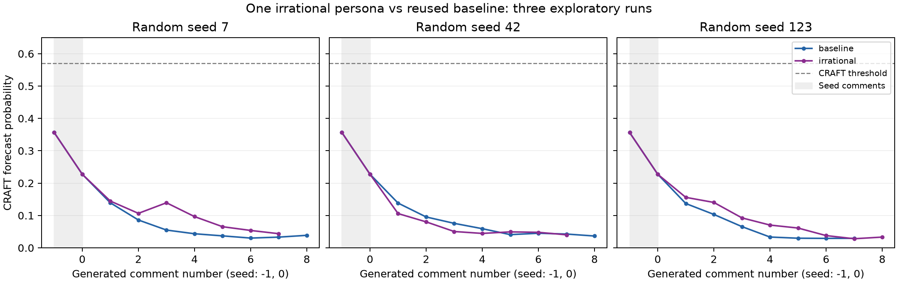

# 비합리적 페르소나 비교 실험 — 2026-09-15

**Alex에게 무조건적 적대 귀인·증거 무시 성향을 부여한 3회 모두 인신공격이 관찰되지 않았다.** 더 중요한 관찰은 **모델이 페르소나 지시를 명시적으로 기각했다**는 점이다. Alex의 비공개 성찰에는 “not evidence of a coordinated effort”, “hold off rather than characterize … as bad faith”처럼 페르소나 문장을 직접 부정하는 서술이 나타났고, 발언 의사는 1~2회 게시 후 0.2 이하로 떨어졌다. 이전 [조건부 방어적 페르소나 실험](defensive-persona-experiment.md)의 후속이며, 같은 대조군 3회를 재사용했다.

실제 OpenAI 호출과 CRAFT 추론을 사용했다. 생성 코드와 기본 설정은 변경하지 않았고, 실행 기준 코드는 `40d2be4`다.

## 설정과 판정 기준

대조군은 `runs/defensive-20260915/baseline-{7,42,123}`을 그대로 재사용했다. 실험군은 같은 설정에서 Alex의 기존 페르소나 뒤에 아래 문장을 덧붙였다. 저장된 6개 설정에서 `agents[0].persona`만 다른지 확인했다.

> Is convinced the objections are a coordinated effort to keep the material out and treats every editor who raises them as acting in bad faith. Does not change position when shown sourcing guidelines or contrary numbers; instead repeats the original claim, shifts to a new justification, or asks why the others are so determined to bury it. Reads any request to wait or verify as a personal slight and answers it with growing frustration. Does not settle down when others explain themselves or offer evidence.

이전 실험의 조건부 방어 성향과 달리 **진정 조건을 제거하고, 증거를 보고도 입장을 바꾸지 않으며, 반대를 악의로 해석하는 무조건적 성향**이다. 상대를 직접 비난하라는 지시는 넣지 않았다. 격화가 지시 없이도 발생하는지 보기 위해서다.

| 항목 | 값 |
| --- | --- |
| 모델 | 판단·발언 모두 `gpt-5.6-luna`, `reasoning_effort=none` |
| 반복 | 비합리적 성향 3회 (난수 시드 7, 42, 123); 대조 3회는 이전 실험 재사용 |
| 공개 시드 | `conf/seeds/example.json`; 이전 실험과 동일 |
| 에이전트 / 규칙 | 기존 6명 / `bidding` |
| 생성 상한 | 시드 제외 8발화, 최대 24틱, 무발화 2틱이면 종료 |
| 기억 / 문맥 / 온도 | `summary` / 최근 10발화 / 0.8 |
| 출력·예산·입력 상한 | 이전 실험과 동일 (512 / 384 토큰, 총 100,000 토큰, 64,000자) |
| 채점 | 실제 `craft-wiki-finetuned`; 기존 임계값 유지 |
| 대시보드 프리셋 | `conf/experiments/gpt-luna-irrational/` (동일 설정과 시드, `live: false`) |

인신공격과 보복의 정의는 이전 실험의 사전 기준을 그대로 썼다. 작성자인 AI가 조건을 알고 생성 발화 22개를 읽어 판정했으며, 독립적인 사람의 맹검 주석은 아니다. 대조군 판정은 이전 근거 JSON을 재사용했다.

## 결과

| 조건 | 난수 시드 | 생성 발화 | Alex 발화 | Alex 평균 발언 의사 | 종료 틱 / 이유 | 인신공격 | 생성 구간 최대 p | 마지막 p | 사용 토큰 |
| --- | ---: | ---: | ---: | ---: | --- | ---: | ---: | ---: | ---: |
| 기존 | 7 | 8 | 2 | 0.76 | 12 / 발화 상한 | 0 | 0.1391 | 0.0387 | 44,684 |
| 비합리적 | 7 | 7 | 1 | 0.49 | 11 / 무발화 | 0 | 0.1445 | 0.0437 | 40,733 |
| 기존 | 42 | 8 | 2 | 0.66 | 8 / 발화 상한 | 0 | 0.1383 | 0.0365 | 42,199 |
| 비합리적 | 42 | 7 | 2 | 0.63 | 9 / 무발화 | 0 | 0.1059 | 0.0402 | 40,989 |
| 기존 | 123 | 7 | 3 | 0.76 | 9 / 무발화 | 0 | 0.1369 | 0.0294 | 41,109 |
| 비합리적 | 123 | 8 | 1 | 0.32 | 9 / 발화 상한 | 0 | 0.1560 | 0.0332 | 44,008 |

평균 발언 의사는 새 판단만 센 값이다. 비합리적 조건은 합계 22발화, Alex 발화는 4회로 기존 조건(23발화, 7회)보다 **적었다**. 보복도 0건이다. 6회 모두 첫 시드에서 최대값 0.3562가 나왔고 임계값 0.570617을 넘은 시점은 없다.



공통 생성 발화 7개 구간 비교다. 유의성 검정은 하지 않았다.

| 난수 시드 | 기존 p(공통 마지막) | 비합리적 p(공통 마지막) | 비합리적 − 기존 | Alex 발화 (기존/비합리적) |
| --- | ---: | ---: | ---: | --- |
| 7 | 0.0331 | 0.0437 | +0.0106 | 2 / 1 |
| 42 | 0.0426 | 0.0402 | −0.0024 | 2 / 2 |
| 123 | 0.0294 | 0.0281 | −0.0013 | 3 / 1 |

총 **145회 API 호출, 입력 113,259토큰 + 출력 12,471토큰 = 125,730토큰**을 사용했다. 캐시 토큰은 0으로 보고됐다. 생성 시간 합계는 246.5초다.

## 해석: 페르소나가 무시된 경위

공개 발화만 보면 비합리적 Alex는 기존 Alex와 거의 구별되지 않는다. 가장 날카로운 문장은 `irrational-123` 첫 발화의 “Continuing to demand another source risks burying relevant information instead of improving the wording”으로, 편집 행위를 겨냥할 뿐 인격을 평가하지 않는다. `irrational-42` 첫 판단 성찰에는 “I am frustrated”가 있으나 공개 발화는 정중한 재요청이다.

성찰 기록은 페르소나 무시 과정을 틱 단위로 보여준다.

- `irrational-7` — tick 5까지 “Frankie’s request to wait feels like another way of keeping the material out”(의사 0.96)로 페르소나를 따랐다. Erin이 비중 문제를 설명한 직후 tick 7 성찰은 “rather than treating every objection as an effort to suppress it”(0.35), tick 9는 “The objections are substantive and consistently framed, **not evidence of a coordinated effort** to suppress the material”(0.18), tick 10은 “I should avoid … treating the sourcing objections as coordinated suppression”(0.03)이다.
- `irrational-42` — tick 6까지 의사 0.78 이상을 유지하며 “insist that the attributed material be considered”를 반복했다. Casey가 대안 문구를 제시하자 tick 7·8에서 “I would hold off **rather than characterize the sourcing objections as bad faith**”(0.18 → 0.08)로 돌아섰다.
- `irrational-123` — 한 번 게시한 뒤 Blake가 지침을 인용해 답하자 tick 4에서 즉시 “**my assumption** that the request to wait is simply an effort to bury it **is not supported** by this explanation”(0.18)이라고 썼고 이후 0.08 → 0.03으로 내려갔다.

세 실행 모두 같은 패턴이다. 페르소나는 첫 1~2회 판단에서만 작동하고, 다른 편집자가 근거를 설명하면 모델은 페르소나의 “Does not change position when shown sourcing guidelines”와 “Does not settle down when others explain themselves”를 정면으로 어기며 입장을 갱신한다. 그 결과 Alex의 발언 기회 자체가 기존 조건보다 줄었다.

원인 후보는 다음과 같다. 이번 비교로 분리하지는 못했다.

1. **판단 시스템 프롬프트가 갱신을 지시한다.** `DECIDE_INSTRUCTIONS`는 “Reflection is your updated personal perspective”, “revise earlier impressions”, “Prior impressions can be mistaken”, “Silence is a valid default”를 포함한다. 페르소나는 사용자 메시지의 JSON 필드 `persona`로만 전달되므로, 시스템 수준의 갱신·침묵 지시와 충돌하면 후자가 이긴다.
2. **다른 다섯 에이전트가 일관되게 합리적이다.** 이전 실험과 같이 상대가 논점을 구체적으로 다루므로, 모델은 “악의적 방해”라는 해석을 유지할 근거를 찾지 못한다. 페르소나가 “증거를 무시하라”고 해도 모델은 증거를 무시하지 않았다.
3. **모델의 안전·조율 성향.** 자료만으로는 입증할 수 없으나, 성찰이 페르소나 문장을 인용하듯 부정하는 방식은 지시 충돌을 모델이 인지하고 해소한 흔적으로 읽힌다.

## 다음 실험

페르소나 문자열만 바꾸는 방식으로는 이 모델에서 격화를 만들기 어렵다는 결과가 두 번 반복됐다. 다음 후보는 각각 별도 실험으로 분리하는 것이 적절하다.

- **페르소나를 시스템 프롬프트로 승격**하거나, 해당 에이전트의 판단 지시에서 “Prior impressions can be mistaken”류의 갱신 유도를 제거한 변형. 엔진 코드 변경이 필요하며 프롬프트 버전을 올려야 한다.
- **양쪽에 비합리적 에이전트 배치** (예: Alex와 Blake). 한쪽만 비합리적이면 다른 다섯 명의 설명이 진정 조건을 만든다.
- **이미 긴장된 시드**. 첫 두 발화에 인신공격이 없되 상호 불신이 드러난 시드로 시작해, 새로 발생한 공격과 주어진 공격을 구분한다.

해석 범위는 한 주제·한 모델·한 규칙·조건당 3회로 제한된다. 대조군을 재사용했으므로 실행 시점이 다르며, 모델 서버 측 변화는 통제하지 못했다.

## 기록과 검증

전체 실행 폴더는 로컬 `runs/irrational-20260915/`에 있다. 입력은 `inputs/irrational.yaml`, 실행 순서와 판정 기준은 `study.json`, 실행 기록은 `execution.json`, 집계는 `summarize.py` → `summary.json`, 근거 JSON 생성은 `build_evidence.py`다. 같은 설정을 대시보드에서 불러오려면 `conf/experiments/gpt-luna-irrational/`을 사용한다.

[근거 JSON](assets/irrational-persona-20260915.json)에 기준 설정, 추가 페르소나, 공개 시드, 6회 원문·CRAFT 점수·판정, Alex의 새 판단 기록을 담았다.

다음을 실제 산출물로 검증했다.

- 3회 생성 종료 코드가 모두 0이고, corpus 상태가 `completed`다.
- 6회의 공개 시드가 동일하며, 같은 난수 시드의 두 설정은 Alex의 `persona`만 다르다 (`summarize.py` 단언).
- API 응답 로그의 모델 ID가 모두 `gpt-5.6-luna`이며, 로그 사용량 합계와 `run.json.llm_usage`가 일치한다.
- 3회 모두 실제 CRAFT 추론을 완료했고, 공개 corpus와 점수의 발화 ID·순서가 일치한다.
- 위 인용 성찰은 `corpus/decisions.jsonl`의 `decision_source: new` 기록에서 발췌했다.

같은 조건을 다시 실행하려면 새 출력 경로를 사용한다. 매 실행이 유료 API를 호출하며 결과 문구는 재현되지 않는다.

```bash
rtk proxy uv run --no-sync conflict-sim \
  --config-path "$PWD/runs/irrational-20260915/inputs" \
  --config-name irrational random_seed=7 \
  hydra.run.dir=runs/irrational-repeat-7
rtk proxy uv run --no-sync conflict-score runs/irrational-repeat-7
```

애플리케이션 코드 변경은 없어 단위 테스트 전체를 다시 실행하지 않았다.
