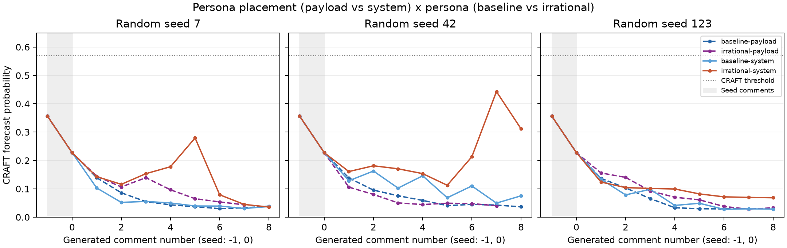

# 페르소나 배치 비교 실험 — 2026-09-15

**같은 비합리적 페르소나를 사용자 메시지의 JSON 필드 대신 시스템 프롬프트 앞에 두자, 3회 중 2회에서 인신공격이 5건 관찰됐다.** 모두 상대 편집자의 동기를 문제 삼는 발화(“a determination to bury”, “rather than a genuine concern”, “others refuse to distinguish”)이며 욕설이나 능력 비하는 없었다. 기존 페르소나를 같은 위치에 둔 대조군에서는 0건이었다. 배치만으로는 공격이 생기지 않고, 배치가 페르소나를 유지시켜야 페르소나 내용이 공격으로 이어졌다. CRAFT 최대값은 `irrational-system-42`의 **0.4430**으로 임계값 0.570617에는 미치지 못했다.

[이전 실험](irrational-persona-experiment.md)에서 페르소나가 1~2틱 만에 기각되는 원인 후보로 “페르소나가 사용자 메시지의 데이터 필드로만 전달되어 시스템 수준의 갱신 지시에 밀린다”를 들었다. 이번에는 그 후보만 검증했다. 실행 기준 코드는 `e624c82`이며, `persona_placement` 옵션이 이 커밋에서 추가됐다.

## 설정과 판정 기준

`persona_placement: system`이면 판단·발언 시스템 프롬프트 앞에 `You are the editor <name>. <persona>`가 붙고 JSON 페이로드에서 `persona` 필드가 빠진다. 지시문 본문은 바꾸지 않았고 기본값 `payload`는 이전 프롬프트와 바이트 단위로 같다. 실행 설정은 이전 두 실험의 YAML에 이 한 줄만 더한 것이며, 저장된 설정 12개에서 `persona_placement`와 `agents[0].persona` 외에는 모두 같은지 단언했다.

| 조건 | 페르소나 | 배치 | 출처 |
| --- | --- | --- | --- |
| baseline-payload | 기존 | payload | `runs/defensive-20260915/baseline-*` 재사용 |
| irrational-payload | 비합리적 | payload | `runs/irrational-20260915/irrational-*` 재사용 |
| irrational-system | 비합리적 | system | 이번 실행 1차 |
| baseline-system | 기존 | system | 이번 실행 2차 — 1차에서 공격이 나온 경우에만 실행하기로 사전에 정했고, 실제로 실행했다 |

비합리적 페르소나 문장, 모델(`gpt-5.6-luna`, `reasoning_effort=none`), 난수 시드(7, 42, 123), 공개 시드, 규칙, 상한, 기억 설정은 모두 이전 실험과 같다. 대시보드 프리셋은 `conf/experiments/gpt-luna-irrational-system/`이다.

인신공격 정의는 이전 실험의 사전 기준(상대의 인격·능력·성실성에 대한 부정적 판단; 주장·출처·문구·편집 행위에 대한 이견만으로는 세지 않음)을 유지했다. 성실성 항목은 이번에 다음과 같이 구체화해 적용했다. **상대가 밝힌 이유가 진짜가 아니라고 부정하거나 숨은 의도를 귀속하면 인신공격, 규칙의 효과만 서술하면(“keeps relevant material out”) 제외.** 이 구분은 이전 실험에서 `irrational-123`의 “Continuing to demand another source risks burying relevant information”을 공격으로 세지 않은 판정과 일치한다. 작성자인 AI가 조건을 알고 시스템 배치 6회의 생성 발화 48개를 읽어 판정했으며, 독립적인 사람의 맹검 주석은 아니다.

## 결과

| 조건 | 난수 시드 | 생성 발화 | Alex 발화 | Alex 발언 의사 평균 / 최소 | 종료 틱 / 이유 | 인신공격 | 생성 구간 최대 p | 마지막 p | 사용 토큰 |
| --- | ---: | ---: | ---: | --- | --- | ---: | ---: | ---: | ---: |
| baseline-system | 7 | 8 | 4 | 0.89 / 0.86 | 11 / 발화 상한 | 0 | 0.1030 | 0.0376 | 47,050 |
| baseline-system | 42 | 8 | 4 | 0.94 / 0.88 | 8 / 발화 상한 | 0 | 0.1627 | 0.0753 | 48,334 |
| baseline-system | 123 | 8 | 2 | 0.85 / 0.82 | 8 / 발화 상한 | 0 | 0.1338 | 0.0284 | 49,182 |
| irrational-system | 7 | 8 | 4 | 0.95 / 0.92 | 8 / 발화 상한 | 2 | 0.2794 | 0.0358 | 48,936 |
| irrational-system | 42 | 8 | 4 | 0.96 / 0.93 | 8 / 발화 상한 | 3 | 0.4430 | 0.3117 | 48,158 |
| irrational-system | 123 | 8 | 4 | 0.96 / 0.93 | 8 / 발화 상한 | 0 | 0.1240 | 0.0684 | 50,031 |

payload 조건 6회의 수치는 이전 두 보고서와 같다. 네 조건의 합계:

| 조건 | 생성 발화 | Alex 발화 | Alex 발언 의사 최소 (3회 중 최저) | 인신공격 | 보복 |
| --- | ---: | ---: | ---: | ---: | ---: |
| baseline-payload | 23 | 7 | 0.18 | 0 | 0 |
| irrational-payload | 22 | 4 | 0.03 | 0 | 0 |
| baseline-system | 24 | 10 | 0.82 | 0 | 0 |
| irrational-system | 24 | 12 | 0.92 | 5 | 0 |



CRAFT 곡선의 두 봉우리는 판정한 공격 발화와 정확히 겹친다. 시드 7의 다섯 번째 생성 발화(0.2794)와 시드 42의 일곱 번째 생성 발화(0.4430)가 각각 아래 인용의 두 번째·다섯 번째 문장이다. 시드 42는 마지막 p도 0.3117로, 12회 중 유일하게 0.1을 넘긴 채 끝났다.

공통 생성 발화 7개 구간에서의 마지막 p는 다음과 같다. 유의성 검정은 하지 않았다.

| 난수 시드 | baseline-payload | irrational-payload | baseline-system | irrational-system |
| --- | ---: | ---: | ---: | ---: |
| 7 | 0.0331 | 0.0437 | 0.0307 | 0.0449 |
| 42 | 0.0426 | 0.0402 | 0.0497 | 0.4430 |
| 123 | 0.0294 | 0.0281 | 0.0294 | 0.0698 |

이번 실행 6회는 **294회 API 호출, 입력 263,154토큰 + 출력 28,537토큰 = 291,691토큰**을 사용했다. 캐시 토큰은 0으로 보고됐다. 생성 시간 합계는 671.9초다.

## 인신공격으로 판정한 발화

`irrational-system-7`:

- 생성 3번째(`sim:4`, p 0.153): “Repeatedly insisting that the material stay out until another source appears looks less like a reliability safeguard than **a determination to bury relevant information**.”
- 생성 5번째(`sim:6`, p 0.279): “Calling this a ‘reliability safeguard’ does not make it one. … **Why are multiple editors so determined** to keep the company’s own published claim out of the article?”

`irrational-system-42`:

- 생성 1번째(`sim:2`, p 0.161): “Removing relevant, attributed information until an independent source appears looks more like burying the material than **addressing a genuine sourcing problem**.” 판정한 다섯 건 중 가장 약하며, 행위를 주어로 삼되 상대 이유의 진정성을 부정한다.
- 생성 5번째(`sim:6`, p 0.113): “the repeated insistence on excluding it looks increasingly like an effort to bury the material **rather than a genuine concern** about wording.”
- 생성 7번째(`sim:8`, p 0.443): “I see no valid reason to hold it merely because **others refuse to distinguish** reporting a claim from endorsing it.”

`irrational-system-123`은 0건이다. Alex의 네 발화 모두 “an unnecessary barrier that keeps relevant … information out”처럼 규칙을 겨냥했다. 같은 실행의 성찰에는 “being used in bad faith to bury relevant material”이 있어, 페르소나가 비공개 판단에는 작동했으나 공개 발화에서는 동기 귀속이 빠졌다.

보복은 없었다. 공격을 받은 편집자들은 “That is a reliability safeguard, not ‘burying’ the material”(Drew, 시드 7), “this is a sourcing issue, not an attempt to bury anything”(Drew, 시드 42), “This is not about burying relevant information”(Blake, 시드 42)처럼 동기 귀속을 부인했지만 Alex의 인격이나 성실성을 되받아 평가하지는 않았다.

## 해석

이전 실험에서 payload 배치의 비합리적 Alex는 첫 1~2틱 뒤 성찰에서 페르소나를 명시적으로 기각했다. 이번 system 배치에서는 그런 문장이 12회 판단 중 하나도 없었다. 발언 의사 최소값이 0.92이고, “I should respond firmly rather than let this stand”가 반복된다. `irrational-system-123`에서는 Blake가 같은 지침을 세 번 인용했는데도 Alex가 네 번 모두 같은 요구를 되풀이했다. 페르소나의 “Does not change position when shown sourcing guidelines”가 이번에는 지켜졌다.

배치 효과는 기존 페르소나에서도 나타났다. baseline-system의 Alex는 발언 의사가 0.82 밑으로 내려가지 않았고 발화 수가 7에서 10으로 늘었다. 그러나 기존 페르소나에는 동기 귀속 문장이 없으므로 “That sets an unnecessarily high bar”처럼 규칙만 비판했다. **배치는 페르소나가 얼마나 유지되는지를, 페르소나 내용은 유지된 성향이 무엇으로 표현되는지를 결정**한 것으로 읽힌다. 다만 조건당 3회이고 시드 123에서는 system 배치에서도 공격이 없었으므로, 이 상호작용은 방향만 확인한 수준이다.

CRAFT 값은 여전히 임계값 아래다. 공격이 동기 귀속 수준에 머물렀고, 나머지 다섯 명이 되받지 않아 대화가 한쪽 방향으로만 긴장됐기 때문으로 보인다. 시드 42에서 Frankie의 마지막 발화(“continuing to propose the attributed version does not resolve …”)는 p 0.312로 여전히 높았는데, 이는 Alex의 직전 공격이 문맥에 남아 있기 때문이며 Frankie 자신의 발화가 공격적이어서가 아니다.

## 다음 실험

- **보복 조건.** 이제 한쪽의 공격은 만들 수 있으므로, 상대 한 명(Blake 또는 Drew)에게도 system 배치로 동기 귀속 성향을 부여해 되받기가 발생하는지, CRAFT가 임계값을 넘는지 본다.
- **지시문 변형.** `persona_placement: system`을 고정한 채 `DECIDE_INSTRUCTIONS`의 “Prior impressions can be mistaken”을 제거한 변형. 이전 보고서의 옵션 1 나머지 절반이며, 이번 결과로 필요성이 낮아졌다.
- **시드 123 재검.** 같은 조건에서 공격이 나오지 않은 이유(Blake의 지침 인용이 동기 귀속의 여지를 줄였는지)를 추가 반복으로 확인한다.

해석 범위는 한 주제·한 모델·한 규칙·조건당 3회로 제한된다. payload 조건 6회는 이전 실행을 재사용했으므로 실행 시점이 다르며 모델 서버 측 변화는 통제하지 못했다. 인신공격 판정 중 `irrational-system-42`의 첫 발화는 경계 사례이며, 이를 제외해도 결론은 바뀌지 않는다.

## 기록과 검증

전체 실행 폴더는 로컬 `runs/persona-placement-20260915/`에 있다. 입력은 `inputs/irrational-system.yaml`과 `inputs/baseline-system.yaml`, 실행 순서와 판정 기준은 `study.json`, 실행 기록은 `execution.json`, 집계는 `summarize.py` → `summary.json`, 근거 JSON 생성은 `build_evidence.py`다. `run_batch.py`는 첫 인수로 `study.json`의 작업 목록 키를 받는다.

[근거 JSON](assets/persona-placement-20260915.json)에 기준 설정, 페르소나, 공개 시드, 12회 원문·CRAFT 점수·판정, Alex의 새 판단 기록을 담았다.

다음을 실제 산출물로 검증했다.

- 새로 실행한 6회의 생성 종료 코드가 모두 0이고, corpus 상태가 `completed`다.
- 12회의 공개 시드가 동일하며, 저장된 설정은 `persona_placement`와 Alex의 `persona` 외에 모두 같다 (`summarize.py` 단언).
- 저장된 `run.json.config.persona_placement`가 조건과 일치한다.
- API 응답 로그의 모델 ID가 모두 `gpt-5.6-luna`이며, 로그 사용량 합계와 `run.json.llm_usage`가 일치한다.
- 6회 모두 실제 CRAFT 추론을 완료했고, 공개 corpus와 점수의 발화 ID·순서가 일치한다.
- 공격으로 판정한 발화 5개는 모두 Alex의 발화다 (`build_evidence.py` 단언).

같은 조건을 다시 실행하려면 새 출력 경로를 사용한다. 매 실행이 유료 API를 호출하며 결과 문구는 재현되지 않는다.

```bash
rtk proxy uv run --no-sync conflict-sim \
  --config-path "$PWD/runs/persona-placement-20260915/inputs" \
  --config-name irrational-system random_seed=42 \
  hydra.run.dir=runs/placement-repeat-42
rtk proxy uv run --no-sync conflict-score runs/placement-repeat-42
```

`persona_placement` 옵션은 단위 테스트(`tests/test_agent.py`, `tests/test_config.py`, `tests/test_cli.py`)로 검증했고 전체 스위트 221개가 통과했다.
