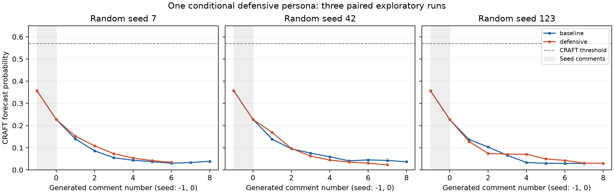

# ConflictDynamics

## 위키 토론형 LLM 에이전트 갈등 시뮬레이터

**정중하게 시작한 온라인 토론은 왜, 언제 인신공격으로 무너지는가?**
사람 대신 LLM 에이전트 3~6명이 위키피디아 토론을 이어가게 하고, 그 과정을 기록·측정하는 실험 장치입니다.

- 상태: 설계 1~5단계 구현 완료, 첫 탐색 실험 1회 수행
- 기준일: 2026-09-15 (커밋 `594d9dc`)
- 언어: 대화는 영어, 문서는 한국어

---

## 1. 한 장 요약

| 질문 | 답 |
|---|---|
| 무엇을 만드나 | 소규모 편집자 토론을 생성하는 Python 시뮬레이터 |
| 누가 말하나 | 입장과 말투만 다른 LLM 에이전트 3~6명 |
| 무엇을 재나 | 대화가 인신공격으로 파탄날 확률 `p(t)` (CRAFT 모델) |
| 어디에 쓰나 | 갈등이 생기는 조건, 격화 속도, 개입 효과의 관측 |
| 지금 어디까지 | 생성·저장·채점·실시간 대시보드까지 동작, 통계 검증은 아직 |

---

## 2. 왜 만드는가

- 위키피디아 토론(CGA 데이터셋)에서 갈등은 **6턴 안에** 터집니다. 시작은 모두 정중합니다.
- 사람 대상으로는 "같은 대화를 조건만 바꿔 100번 반복"할 수 없습니다.
- LLM 에이전트라면 **같은 시작 대화**에 순서 규칙·기억·페르소나만 바꿔 반복할 수 있습니다.
- 목표는 사람 행동의 예측이 아니라, **갈등 동역학을 통제된 조건에서 관측**하는 것입니다.

> 비목표: 대규모 소셜미디어 시뮬레이션, 실시간 모더레이션 시스템, 인간 행동 예측 정확도

---

## 3. 연구 질문

| | 질문 | 관측 대상 |
|---|---|---|
| RQ1 | 갈등은 어떤 조건에서 발생하는가 | `p(t)`가 임계값을 처음 넘는 시점 |
| RQ2 | 무엇이 격화를 가속·감속시키는가 | 발화별 `p(t)` 변화량 |
| RQ3 | 어떤 개입이 언제 효과적인가 | 개입 발화 전후의 `p(t)` 변화 |

- 세 질문 모두 `p(t)` 하나로 조작적 정의합니다. (한계는 14장 참고)
- RQ3는 개입 시점 기록 기능이 아직 없어 후속 과제입니다.

---

## 4. 왜 위키피디아 토론 페이지인가

기존 연구 자산을 **도메인 변환 없이** 그대로 쓸 수 있기 때문입니다.

| 자산 | 내용 | 본 프로젝트에서의 역할 |
|---|---|---|
| CGA-Wiki 데이터셋 | 실제 토론 4,188개, 코멘트 30,021개. 격화/비격화 대화가 짝지어짐 | 시작 대화(시드)와 비교 기준 |
| CRAFT 예측 모델 | "이 대화가 인신공격으로 끝날 확률"을 대화 진행 중 예측 | 측정 도구 |
| ConvoKit | 위 둘을 다루는 Python 툴킷과 데이터 형식 | 출력 형식과 채점 파이프라인 |

- CGA 실측: 턴 수 3~19 (중앙값 6), 참여자 소규모 → 기본 `max_ticks: 12`, 에이전트 3~6명
- 참여자가 2명이면 개입할 제3자가 없으므로 최소 3명

---

## 5. 처음 보는 사람을 위한 용어

| 용어 | 뜻 |
|---|---|
| 에이전트 | 한 명의 가상 편집자. LLM에게 페르소나를 주고 역할을 맡김 |
| 페르소나 | 문서에 대한 입장 + 말투 + 배경. **공격성은 넣지 않음** |
| 시드 | 시뮬레이션 시작 시 주어지는 처음 두 발화 |
| 틱 | 모든 에이전트에게 발언 기회를 한 번씩 주는 단위 시간 |
| urge | "지금 말하고 싶은 정도" 0~1. 분노나 갈등 강도가 아님 |
| 확률 게이트 | `urge × availability` 확률로 실제 게시 여부 결정 |
| 성찰(reflection) | 에이전트가 매 판단마다 남기는 2~4문장 자기 관점. 본인만 봄 |
| `p(t)` | t번째 발화까지 읽은 CRAFT가 예측한 "인신공격으로 파탄날 확률" |
| corpus | 한 실행의 결과 폴더. ConvoKit 형식(발화·화자·대화 JSON) |

---

## 6. 전체 흐름

```
설정(YAML) + 시드 → 엔진(틱 루프) → corpus 저장 → CRAFT 채점 → scores.json
                         ↑ LLM 호출                    ↑ 대시보드에서 관찰
```

| 단계 | 하는 일 | 파일 |
|---|---|---|
| 설정 | Hydra로 YAML 합성, Pydantic으로 타입·범위 검증 | `conf/config.yaml`, `models.py` |
| 엔진 | 틱마다 순서 규칙에 따라 판단·게시·종료 결정 | `engine.py` |
| 에이전트 | `decide`(판단)와 `speak`(발화) 두 번의 LLM 호출 | `agent.py`, `llm.py` |
| 저장 | ConvoKit 형식으로 원자적 저장. 실패 시 corpus 없음 | `storage.py` |
| 채점 | 완료된 corpus를 읽어 `p(t)` 산출. **생성과 완전 분리** | `score.py` |

- 생성은 자기가 얼마나 갈등적인지 모릅니다. 채점 결과가 생성에 되먹임되지 않습니다.

---

## 7. 한 틱에서 일어나는 일

```
대화 읽기 → decide → 순서 규칙 → 확률 게이트 → speak → 공개 게시
              ↓
        성찰 저장 (게시 여부와 무관)
```

1. **읽기** — 아직 안 읽은 발화 전부 + 최근 10개 + 자기 기억을 프롬프트에 넣음
2. **decide** — LLM이 JSON으로 `{urge, reply_to, reflection}` 반환. 침묵이 기본값
3. **순서 규칙** — 누가 게시 후보가 되는지 결정 (8장)
4. **확률 게이트** — 후보라도 `urge × availability` 확률로만 게시
5. **speak** — 통과한 경우에만 답글 본문 생성

> 설계 결정: 한 틱에 여러 명 게시 허용 · 침묵도 사유별로 기록 · 정상 종료는 "연속 2틱 아무도 안 말함"

---

## 8. 발언 순서 규칙은 실험 변수다

순서를 하나로 고정하면 관측된 갈등 패턴이 순서 규칙의 인공물이 됩니다. 그래서 설정으로 바꿉니다.

| 규칙 | 동작 | 한 틱 게시 | 갈등 표현력 |
|---|---|---|---|
| `round_robin` | 정해진 순서로 모두 평가 | 여러 명 | ✕ 발언권 경쟁 없음 |
| `random` | 매 틱 평가 순서 셔플 | 여러 명 | △ 순서 편향만 제거 |
| `bidding` (기본) | 같은 대화를 본 뒤 urge 최고 1명만 후보 | 최대 1명 | ◎ 격화가 발언 빈도에 반영 |
| `event_driven` | 새 답글·`@호명`·보류 판단이 있을 때만 참여 | 여러 명 | ◎ 무응답 사유 관측 가능 |

- `bidding`에서 승자가 게이트를 못 넘으면 그 틱은 아무도 안 씀 (차순위 없음)
- 새 글이 없으면 LLM을 다시 부르지 않고 보류된 판단을 재사용

---

## 9. 페르소나 설계 원칙

**입장 + 말투 + 배경까지만.** "공격적이다", "쉽게 화낸다"는 금지.

- 공격성을 넣으면 갈등이 창발한 게 아니라 주입된 것
- CGA 대화는 전부 정중하게 시작해 무너지므로, 전제를 맞춰야 비교 가능

기본 프리셋 — "회사 보고서의 환경 편익 주장을 문서에 넣을 것인가?"

| 이름 | 입장 |
|---|---|
| Alex | 회사 보고서를 명시해 지금 반영 |
| Blake | 독립 출처 확보 전에는 반영 반대 |
| Casey | 근거를 정확히 담도록 문구 수정 |
| Drew | 회사 보고서의 수치와 근거 의심 |
| Erin | 문서 전체의 비중과 균형 우선 |
| Frankie | 합의 전 편집 중단과 절차 준수 |

---

## 10. 성찰과 개인 기억

매 판단마다 성찰을 남기고, 다음 판단·발화에 **자기 것만** 다시 넣습니다. 다른 에이전트·채점기에는 전달하지 않습니다.

| `memory_mode` | 다음 프롬프트에 넣는 기억 | 용도 |
|---|---|---|
| `none` | 없음 (기록은 함) | 기억 효과를 분리하는 대조 조건 |
| `summary` (기본) | 가장 최근 성찰 1개 (누적 요약) | 표준 실행 |
| `full` | 성찰 전체 이력 | 긴 실행에서 입력 길이 증가 |

- 별도 요약·기억 관리 호출 없음. `decide` 응답 하나에 함께 받음
- 성찰은 모델의 **자기보고**이지 내부 상태의 측정값이 아님

---

## 11. 측정 — CRAFT `p(t)`

ConvoKit의 CRAFT Forecaster(EMNLP 2019)에 저자 제공 `craft-wiki-finetuned` 가중치를 그대로 사용합니다. 학습 없음.

| 지표 | 의미 |
|---|---|
| `max_p`, `final_p` | 전체 발화 중 최대 확률, 마지막 발화 시점 확률 |
| `max_delta_p` | 인접 발화 간 확률 상승폭의 최댓값 |
| `threshold_exceeded` | 한 번이라도 `p > 0.570617`(제공 임계값)이었는지 |
| `first_threshold_crossing` | 최초 임계 초과 발화의 위치·ID·틱 |

- `p(t)`는 **파탄 가능성의 예측값**이지 갈등 강도가 아닙니다. 임계 초과 ≠ 실제 인신공격
- 실제 사건 라벨이 없어 forecast horizon(경보~사건 거리)은 산출하지 않음
- CRAFT 성능 상한: CGA F1 66.9

---

## 12. 검증 프로토콜 — CGA 짝 시드

CGA는 격화 대화마다 **같은 페이지의 비격화 대화**를 짝지어 두었습니다 (주제 통제 + 클래스 균형).

1. 짝지어진 대화 쌍 선택
2. 각각 **첫 2턴만** 시드로 주입, 나머지는 에이전트가 생성
3. 쌍마다 N회 반복
4. 격화 쌍에서 나온 시뮬레이션의 격화율이 유의하게 높은가?

차이가 있다면 "초기 신호가 궤적을 결정한다"(Zhang et al. 2018)를 시뮬레이션으로 복제한 것.

- `conflict-seeds` 도구 구현 완료. 2026-09-10 기준 train 1,254쌍 중 **704쌍(시드 1,408개) 보존**, 550쌍 제외
- 둘째 댓글이 첫 댓글의 직접 답글일 때만 채택. 제외 사유는 `manifest.json`에 기록
- 시드별 페르소나 생성과 반복 실험은 **아직 미수행**

---

## 13. 실시간 대시보드

Streamlit 화면에서 실행·관찰·재생·채점을 한곳에서 합니다. 엔진을 직접 부르지 않고 CLI를 별도 프로세스로 띄워 `live.json`을 0.5초마다 읽습니다.

| 화면 | 기능 |
|---|---|
| Live simulation | 프리셋·규칙·기억 모드·틱·난수 시드 선택 → Start / Stop |
| 공개 대화 | 위키 토론 페이지처럼 들여쓰기 답글로 표시 |
| 에이전트 카드 | 게시 안 한 에이전트의 성찰·urge·재사용 여부까지 관찰자에게만 표시 |
| Saved runs | 완료된 실행 목록, 틱 단위 재생(0.5/1/2배속), 판단 로그 |
| Measurements | `p(t)` 곡선, 임계선, 최초 초과 지점, 에이전트별 발언 비중 |
| 실시간 채점 | 토글 켜면 별도 CRAFT 프로세스가 새 발화를 순서대로 채점 |

- 프리셋 3종: 기본 / ‘조사 결과의 해석과 표현’ / ‘문서 재구성과 편집 절차’
- `demo` 백엔드는 API 없이 고정 응답으로 조작 연습 가능

---

## 14. 구현 현황

| 단계 | 내용 | 상태 |
|---|---|---|
| 1 | 데이터 모델 + 틱 루프 엔진 | ✅ |
| 2 | LLM 연결 (demo / OpenAI), 판단·발화 프롬프트 | ✅ |
| 3 | CRAFT 채점 (`conflict-score`) | ✅ |
| 4 | ConvoKit 형식 호환 확인 | ✅ |
| 5 | CGA 시드 추출 (`conflict-seeds`) | ✅ |
| + | 성찰 기억 3모드, 보류 판단 재시도, 실행 무결성 보호 | ✅ |
| + | 대시보드: 실시간 실행, 프리셋, 재생, 실시간 채점 | ✅ |
| + | 대시보드에서 설정·시드 편집 후 저장 | 🔧 진행 중 |
| 6 | 순서 규칙 3조건 ablation + 통계 검증 | ⬜ |

- 소스 약 2,300줄, 테스트 약 2,400줄. 유료 API 없이 전 테스트 실행 가능
- 모델 기본값 `gpt-5.6-luna`, 실행당 토큰 예산 100,000

---

## 15. 첫 실험 — 조건부 방어적 페르소나 (2026-09-15)

**질문**: Alex에게 "반복해서 무시당하면 방어적으로 반응하되, 인정받으면 진정한다"는 조건을 주면 인신공격이 나오는가?

| 조건 | 실행 | 생성 발화 | 인신공격 | 생성 구간 최대 `p` |
|---|---:|---:|---:|---:|
| 기존 페르소나 | 3회 | 23 | 0 | 0.139 |
| 방어적 페르소나 | 3회 | 21 | 0 | 0.169 |

- 6회 모두 임계값 0.5706 미초과. 최대값 0.356은 시드 첫 발화에서 나옴
- 방어적 조건에서도 상대가 논점을 구체적으로 다루면 Alex가 **인정하고 물러섬**
- 총 285회 호출, 약 249k 토큰, 생성 583초



---

## 16. 첫 실험에서 배운 것

- 이 설정만으로는 데모에서 인신공격 격화를 **안정적으로 보여주기 어렵다**
- 다만 조건당 3회, 한 주제·한 모델·한 규칙이므로 "불가능하다"는 결론은 아님
- 방어 조건의 발동 요건("반복 묵살")보다 진정 요건("논점 인정")이 더 자주 충족된 것으로 보임
- 모델 안전 정책 때문인지, 위키 편집자 역할 때문인지, 기억·규칙 효과인지 **분리하지 못함**
- 판정은 조건을 아는 작성자(AI)가 수행. 독립 맹검 주석 아님

> 데모 용도로는 "출처·비중을 둘러싼 이견과 합의 과정" 사례로 쓸 수 있음

---

## 17. 한계와 열린 이슈

| 이슈 | 내용 |
|---|---|
| 강도 축 부재 | CRAFT는 "파탄 확률"만 줌. 격렬하지만 해소되는 갈등과 미지근하게 파탄나는 갈등을 구분 못 함 |
| 다자 대화 | CRAFT는 2인 대화 전제에 가까움. 4명 이상의 연합·방관·개입은 포착 어려움 |
| 과대 생성 위험 | 선행 연구에서 LLM 시뮬레이션은 실제보다 댓글 수·독성이 높았음. 사전 캘리브레이션 필요 |
| 언어 | 영어면 CGA·CRAFT 그대로 사용, 한국어면 셋 다 불가. 현재 영어 |
| 합성 시드 | 기본 시드는 직접 쓴 영어 대화. 갈등 발생률의 근거로 쓰면 안 됨 |
| 비결정성 | `random_seed`는 순서·확률만 고정. LLM 응답은 매번 다름 |

---

## 18. 다음 단계

1. **인정 vs 묵살 비교** — 같은 두 페르소나 조건에서 상대의 반응만 바꿔 비교
2. **CGA 시드 실험** — 추출한 704쌍 중 일부로 격화/비격화 짝 반복 실행, 시드별 페르소나 생성
3. **임계값 캘리브레이션** — CGA 검증 셋에서 결정, 제공값 0.5706 검토
4. **순서 규칙 ablation** — `round_robin` / `bidding` / `event_driven` 3조건 통계 분석
5. **개입 기능** — 개입 발화 시점 기록과 전후 `p(t)` 비교 (RQ3)
6. **강도 축 추가 검토** — 발화 단위 점수기를 CRAFT 위에 별도 층으로

---

## 부록 A. 실행 방법

Python 3.11 이상, [uv](https://docs.astral.sh/uv/) 필요. 저장소 루트에서 실행합니다.

```bash
uv sync --all-extras                      # llm · dashboard · score 모두 설치
uv run --all-extras conflict-sim          # demo: API 없이 동작 확인
uv run --all-extras conflict-sim backend=openai hydra.run.dir=runs/llm-001   # .env에 OPENAI_API_KEY
uv run --all-extras conflict-sim -m rule=round_robin,bidding,event_driven random_seed=7,42   # 멀티런
uv run --all-extras conflict-score --all runs   # 완료된 실행 전부 CRAFT 채점
uv run --all-extras streamlit run src/conflict_sim/dashboard.py   # 대시보드
uv run --all-extras conflict-seeds runs/cga/source/cga-wiki runs/cga/seeds/train   # CGA 시드 추출
```

- `--all-extras` 없이 `uv run`하면 extras가 제거되므로 항상 붙이거나 `--no-sync` 사용
- 결과는 `runs/<날짜>/<시간>/corpus/`. 같은 경로 재사용 거부, 실패 시 corpus 미저장
- CRAFT 첫 실행 시 약 550MB 가중치 다운로드. ConvoKit은 3.x 필요

---

## 부록 B. 코드 지도

| 모듈 | 역할 | 줄 수 |
|---|---|---:|
| `models.py` | 설정 스키마 + 발화·대화 트리 (Pydantic, strict) | 107 |
| `engine.py` | 틱 루프, 순서 규칙, 확률 게이트, 종료 | 164 |
| `agent.py` | 프롬프트, `decide`/`speak`, 성찰 기억 | 97 |
| `llm.py` | `DemoBackend` / `OpenAIBackend`, 토큰 예산 | 146 |
| `storage.py` | 시드 로드, ConvoKit 형식 원자적 저장 | 104 |
| `cli.py` | Hydra 합성, 실행 경로 보호, 진행 스냅샷 | 154 |
| `cga.py` | CGA 짝 선별과 시드 추출 | 118 |
| `score.py` | CRAFT 채점, 지표 산출, 실시간 채점 | 309 |
| `dashboard.py` | Streamlit UI (엔진 미의존, CLI 서브프로세스) | 782 |
| `settings.py` | UI 설정·시드 편집 (진행 중) | 323 |

---

## 부록 C. 참고 자료

- 설계 문서: `docs/conflict-sim-design.md`
- 실험 보고서: `docs/defensive-persona-experiment.md`
- 사용 설명: `README.md`, 개발 지침: `AGENT.md`
- Zhang et al. (2018). *Conversations Gone Awry.* ACL.
- Chang & Danescu-Niculescu-Mizil (2019). *Trouble on the Horizon.* EMNLP.
- Chang et al. (2020). *ConvoKit: A Toolkit for the Analysis of Conversations.*

---

## 부록 D. 이 문서를 슬라이드로 바꾸는 규칙

- `---` 하나 = 슬라이드 1장, `##` = 슬라이드 제목
- 표는 6행 이내, 불릿은 5개 이내로 유지했음
- `>` 인용문은 슬라이드 하단 한 줄 메모
- 코드 블록 흐름도는 도형 2~5개로 다시 그리면 됨
- 이미지 경로는 `docs/` 기준 상대 경로

```bash
npx @marp-team/marp-cli docs/project-intro.md --pptx   # Marp
pandoc docs/project-intro.md -o intro.pptx --slide-level=2   # pandoc
```
