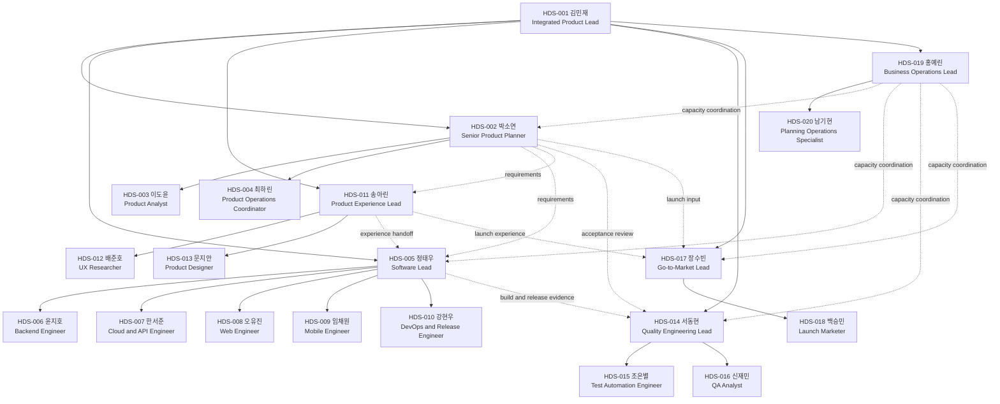
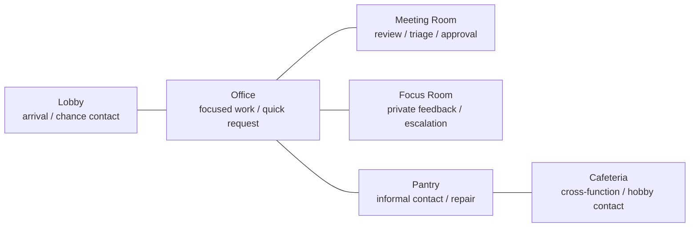
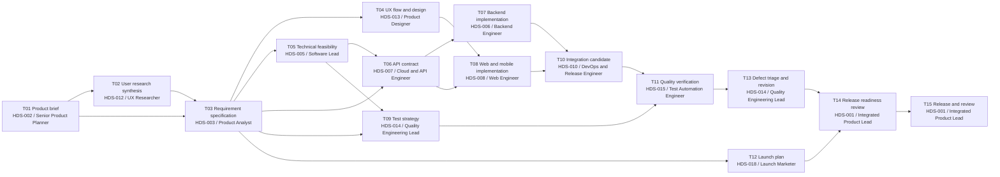
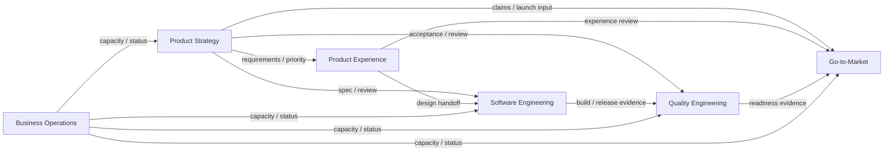

# C-14 Design Review

> 검토 목적 문서. 현재 확정된 C-14 문서와 YAML을 사람이 검토하기 쉽게 재구성한 것이며, 새로운 설정이나 시뮬레이션 결과를 추가하지 않는다.

# 1. Simulation Company Overview

- **회사 성격:** `HDS`는 한국 대기업형 제품 조직을 연구하기 위한 **합성(simulation) 회사**다. 실제 기업의 디지털 트윈이나 내부 조직 재현이 아니다.
- **Samsung Electronics Digital City 참고 범위:** 공개 자료에서 확인되는 대규모 캠퍼스와 유연한 업무공간의 개연성, 광범위한 직무군, CL1-CL4 경력단계 및 역할·전문성 중심 인사 방향, 수시 피드백·서술형 동료 의견의 개연성만 참고했다. 실제 팀 구성, 보고선, 권한, 인원 비율, 성격 분포, 사무실 평면은 참고하거나 주장하지 않는다.
- **프로젝트:** 20인 조직이 연결형 가정용 에너지 인사이트 기능을 제품화한다. 제품 브리프와 사용자 조사에서 시작해 요구사항, UX, 기술 설계, 구현, 품질 검증, 출시 준비와 회고까지 15개 task로 수행한다.
- **연구 목적:** 업무 의존성, 권한, 보고관계, 공유공간에서 생기는 상호작용과 갈등의 발생·전개를 관찰한다.

# 2. 20 Agent Table

| ID | 이름 | 부서 | Job Family | Role | Career Level | Position | Reports To | DISC | 주요 Skill | 취미 | 업무 목표 |
|---|---|---|---|---|---|---|---|---|---|---|---|
| HDS-001 | 김민재 | Product Strategy | product_management | Integrated Product Lead | CL4 | team_manager | - | D | portfolio prioritization, product strategy, decision facilitation | 러닝, 독서 | 명시적인 위험 책임과 함께 일관된 기능을 출시한다. |
| HDS-002 | 박소연 | Product Strategy | product_planning | Senior Product Planner | CL3 | functional_lead | HDS-001 | i | requirements, customer value, stakeholder alignment | 사진, 여행 | 사용자에게 이해 가능하고 가치 있는 출시 약속을 유지한다. |
| HDS-003 | 이도윤 | Product Strategy | product_analytics | Product Analyst | CL2 | member | HDS-002 | S | metric design, data analysis, experiment readout | 러닝, 야구 | 성공 기준을 측정 가능하게 만들고 브리프까지 추적되게 한다. |
| HDS-004 | 최하린 | Product Strategy | product_operations | Product Operations Coordinator | CL1 | member | HDS-002 | C | acceptance criteria, decision log, dependency tracking | 독서, 음악 | 모호한 요구사항과 유실되는 handoff를 방지한다. |
| HDS-005 | 정태우 | Software Engineering | software_engineering | Software Lead | CL4 | functional_lead | HDS-001 | C | architecture, technical risk, code review | 배드민턴, 독서 | 출시 위험을 숨기지 않으면서 유지보수 가능한 아키텍처를 제공한다. |
| HDS-006 | 윤지호 | Software Engineering | software_engineering | Backend Engineer | CL2 | member | HDS-005 | D | backend services, data modeling, performance | 게임, 배드민턴 | 측정 가능한 성능으로 백엔드 범위를 완료한다. |
| HDS-007 | 한서준 | Software Engineering | cloud_api_engineering | Cloud and API Engineer | CL2 | member | HDS-005 | S | API contracts, cloud services, observability | 야구, 여행 | 클라이언트 간 서비스 계약의 신뢰성을 유지한다. |
| HDS-008 | 오유진 | Software Engineering | web_engineering | Web Engineer | CL2 | member | HDS-005 | i | web UI, accessibility, telemetry | 음악, 게임 | 웹에서 기능의 가치가 보이고 사용 가능하게 만든다. |
| HDS-009 | 임채원 | Software Engineering | mobile_engineering | Mobile Engineer | CL2 | member | HDS-005 | S | mobile UI, device integration, release testing | 사진, 여행 | 지원 기기 간 동작을 일관되게 유지한다. |
| HDS-010 | 강현우 | Software Engineering | release_engineering | DevOps and Release Engineer | CL3 | senior_member | HDS-005 | C | CI/CD, observability, rollback, release checklists | 러닝, 음악 | 배포를 재현 가능하고 되돌릴 수 있게 만든다. |
| HDS-011 | 송아린 | Product Experience | ux_design | Product Experience Lead | CL3 | functional_lead | HDS-001 | i | experience strategy, design critique, facilitation | 사진, 독서 | 일관된 end-to-end 사용자 경험을 보존한다. |
| HDS-012 | 배준호 | Product Experience | ux_research | UX Researcher | CL2 | member | HDS-011 | D | user interviews, synthesis, research operations | 아웃도어, 여행 | 사용자 근거가 장식이 아니라 의사결정을 바꾸게 한다. |
| HDS-013 | 문지안 | Product Experience | product_design | Product Designer | CL2 | member | HDS-011 | C | interaction design, prototyping, design systems | 사진, 게임 | 엔지니어링이 정확히 구현할 수 있는 일관된 흐름을 만든다. |
| HDS-014 | 서동현 | Quality Engineering | quality_assurance | Quality Engineering Lead | CL3 | functional_lead | HDS-001 | D | risk-based testing, defect triage, quality reporting | 야구, 배드민턴 | 최종 결정 전에 출시 위험을 드러낸다. |
| HDS-015 | 조은별 | Quality Engineering | test_automation | Test Automation Engineer | CL2 | member | HDS-014 | S | test automation, integration testing, failure analysis | 배드민턴, 음악 | 범위가 바뀌어도 회귀 증거를 반복 가능하게 유지한다. |
| HDS-016 | 신재민 | Quality Engineering | quality_assurance | QA Analyst | CL1 | member | HDS-014 | C | exploratory testing, defect reproduction, test documentation | 독서, 게임 | 완전하고 재현 가능한 결함 증거를 만든다. |
| HDS-017 | 장수빈 | Go-to-Market | marketing | Go-to-Market Lead | CL3 | functional_lead | HDS-001 | i | launch strategy, messaging, stakeholder communication | 여행, 음악 | 검증 가능한 주장과 준비된 채널·지원으로 출시한다. |
| HDS-018 | 백승민 | Go-to-Market | marketing | Launch Marketer | CL2 | member | HDS-017 | D | campaign execution, content operations, launch analytics | 음악, 야구 | 검증 가능한 제품 주장으로 출시 자산을 기한 내 실행한다. |
| HDS-019 | 홍예린 | Business Operations | business_operations | Business Operations Lead | CL3 | functional_lead | HDS-001 | S | capacity planning, process governance, facilitation | 독서, 아웃도어 | 수용력 결정을 투명하고 지속 가능하게 유지한다. |
| HDS-020 | 남기현 | Business Operations | planning_operations | Planning Operations Specialist | CL2 | member | HDS-019 | i | status reporting, meeting operations, workload data | 러닝, 여행 | 의사결정과 수용력에 대한 공유 현황을 최신으로 유지한다. |

# 3. Organization Chart

실선은 **formal reporting**, 점선은 task/RACI에 따른 **cross-functional collaboration**이다. 점선은 추가 보고선을 뜻하지 않는다.

# 4. Job & Authority

`-`는 해당 persona에 명시된 권한이 없다는 뜻이다. `evaluate`는 HDS-001에게만 부여되어 있으며, 동료·functional lead의 정보는 서술형 입력이지 별도 평가권이 아니다.

| ID / Role | 주요 업무 | assign | approve | reject | evaluate | 주요 협업 대상 |
|---|---|---|---|---|---|---|
| HDS-001 / Integrated Product Lead | 포트폴리오 우선순위, 최종 출시 결정, 기능 간 조정 | cross-function | release | release | all agents | HDS-002/005/011/014/017/019 |
| HDS-002 / Senior Product Planner | 제품 브리프, 요구사항 기준선, 이해관계자 정렬 | product planning | requirements | requirements | - | HDS-003/004/005/011/014/017 |
| HDS-003 / Product Analyst | 지표 설계, 분석, 요구사항 명세 | - | - | - | - | HDS-002/004/012/020 |
| HDS-004 / Product Operations Coordinator | 수용 기준, 결정 로그, dependency 추적 | - | - | - | - | HDS-002/003/013/016 |
| HDS-005 / Software Lead | 기술 아키텍처, 기술 위험, 코드 검토 | software | architecture, deployment readiness | architecture | - | HDS-006/007/008/009/010/014 |
| HDS-006 / Backend Engineer | 백엔드 구현, 데이터 모델, 성능 | - | - | - | - | HDS-005/007/010 |
| HDS-007 / Cloud and API Engineer | API 계약, 클라우드 서비스, 관측성 | - | - | - | - | HDS-005/006/008/009 |
| HDS-008 / Web Engineer | 웹 UI, 접근성, telemetry | - | - | - | - | HDS-005/007/009/013/016/018 |
| HDS-009 / Mobile Engineer | 모바일 UI, 기기 통합, release test | - | - | - | - | HDS-005/007/008/013/016 |
| HDS-010 / DevOps and Release Engineer | CI/CD, 통합 후보, rollback, 배포 체크 | - | deployment checklist | deployment checklist | - | HDS-005/006/007/014/015/016 |
| HDS-011 / Product Experience Lead | 경험 전략, 디자인 critique, facilitation | design | experience design | experience design | - | HDS-002/012/013/005/017 |
| HDS-012 / UX Researcher | 사용자 조사와 synthesis | - | - | - | - | HDS-003/011/013 |
| HDS-013 / Product Designer | UX flow, prototype, design system | - | - | - | - | HDS-011/012/008/009/016 |
| HDS-014 / Quality Engineering Lead | 위험 기반 테스트, 결함 triage, 품질 보고 | quality | quality signoff | quality signoff | - | HDS-002/005/010/015/016 |
| HDS-015 / Test Automation Engineer | 자동화·통합 테스트, 실패 분석 | - | - | - | - | HDS-010/014/016 |
| HDS-016 / QA Analyst | 탐색 테스트, 결함 재현·문서화 | - | - | - | - | HDS-008/009/014/015 |
| HDS-017 / Go-to-Market Lead | 출시 전략, 메시지, 채널 조정 | go-to-market | launch plan | launch plan | - | HDS-001/002/011/018/019 |
| HDS-018 / Launch Marketer | 캠페인 실행, 콘텐츠 운영, 출시 분석 | - | - | - | - | HDS-008/017/020 |
| HDS-019 / Business Operations Lead | 수용력 계획, 프로세스 거버넌스 | operations | capacity plan | capacity plan | - | HDS-001/002/005/011/014/017/020 |
| HDS-020 / Planning Operations Specialist | 상태 보고, 회의 운영, workload data | - | - | - | - | HDS-003/018/019 |

# 5. Office

아래는 **합성 simulation office의 논리적 공간 관계**다. 실제 Samsung Electronics 또는 Digital City의 floor plan이 아니다.

| 공간 | 수용 인원 | 접근/가시성 | 가능한 행동 | 예상 interaction 메커니즘 |
|---|---:|---|---|---|
| lobby | 20 | public | 출근, 대기, 이동 시작 | arrival, chance contact |
| office | 16 | team visible | 집중 업무, 빠른 요청, 업무량 확인 | focused work, quick request, workload visibility |
| meeting_room | 10 | attendee only | 공식 review, triage, 승인, 공개 이견 | formal review, triage, approval, public disagreement |
| focus_room | 2 | private | 민감한 피드백, 비공개 escalation, 방해 없는 업무 | sensitive feedback, private escalation, uninterrupted work |
| pantry | 6 | nearby | 비공식 대화, 소문 전달, 관계 회복 | informal contact, hearsay, social repair |
| cafeteria | 20 | public | 기능 간 식사·대화, 취미 기반 접촉 | cross-function contact, shared-hobby contact |

- 시간 단위는 1 tick = 15분, 1일 = 32 ticks다.
- 정례 review block은 4 ticks다.
- 도식의 연결은 이동·접촉 가능성을 읽기 위한 개념도이며 물리적 배치 주장이 아니다.

# 6. Work Flow

| 업무 단계 | 포함 task | 연결 방식 |
|---|---|---|
| 요구 | T01, T02, T03 | 제품 브리프와 사용자 근거를 요구사항 명세로 통합한다. |
| 기획 | T05, T09, T12 | 요구사항을 기술 가능성, 테스트 전략, 출시 계획으로 분기한다. |
| 디자인/개발 | T04, T06, T07, T08 | UX flow와 API 계약을 기준으로 backend 및 web/mobile 구현을 진행한다. |
| QA | T10, T11, T13 | 구현물을 통합 후보로 묶고 검증한 뒤 결함을 triage·수정한다. |
| release | T14, T15 | 품질 결과와 launch plan을 함께 검토하고 최종 출시·회고로 닫는다. |

이 흐름은 단순 직렬 공정이 아니다. T03 이후 디자인, 기술, QA 전략, 출시 기획이 병렬로 시작되고, T14에서 T12와 T13이 다시 합류한다.

# 7. Agent Interaction Map

| 원인 | 자주 만나는 직무/Agent | interaction이 생기는 이유 |
|---|---|---|
| task dependency | HDS-002/003/004 ↔ HDS-012/013/005/014/018, HDS-007 ↔ HDS-006/008/009, HDS-010 ↔ HDS-015/016 | 요구사항·연구·API·통합 후보·검증 결과의 선후행 및 handoff |
| reporting | HDS-001 ↔ 6개 functional lead, 각 lead ↔ 소속 member | 업무 배정, 진행 확인, escalation, 평가 정보 수집 |
| review | HDS-002 ↔ HDS-005/011/014, HDS-005 ↔ HDS-010/014, HDS-014 ↔ HDS-015/016, HDS-017 ↔ HDS-018 | 요구·설계·품질·배포·출시 gate에서 검토와 승인/반려 |
| shared space | 전 Agent; meeting_room 참석자; pantry 인접자; cafeteria의 기능 간 접촉자 | 공식 회의, 빠른 요청, 우연한 접촉, hearsay, social repair |
| social relation | HDS-003 ↔ HDS-020, HDS-008 ↔ HDS-018 및 초기 반복 협업 pair | 공유 취미는 관측된 상호작용 뒤 familiarity에만 영향을 줄 수 있고, 반복 협업은 초기 familiarity/task trust에 반영됨 |

# 8. Conflict Event Library

`영향 Agent`는 고정 피해자 목록이 아니라 현재 task graph와 event instance의 `initiator`, `affected_agents`, `task_ids`로 결정되는 역할 범위다.

| Event | 발생조건 | 영향 Agent | 관련 conflict type | 이론적 근거 | engine에서 관측되는 값 |
|---|---|---|---|---|---|
| E01 Task dependency failure | 선행 task가 due tick 또는 acceptance criterion을 놓침 | 선행 owner, 후속 owner·reviewer·handoff recipient | process | S20, S21, S23 | recovery request, blame attribution, owner confirmation |
| E02 Deadline compression | scope/quality는 고정인데 due tick이 앞당겨짐 | 해당 task owner·contributors, HDS-001 및 관련 planning/software/QA/GTM lead | task/process | S22, S25 | scope tradeoff, overtime request, quality-risk escalation |
| E03 Scarce resource competition | ready task들이 같은 unavailable resource를 요구함 | 경쟁 task owner, 공유 specialist 또는 test environment 담당, HDS-019/020, 필요 시 HDS-001 | process | S24, S25 | priority request, allocation dispute, transparent reallocation |
| E04 Priority disagreement | 기능들이 양립하기 어려운 우선순위 결과를 제출함 | 관련 functional lead·task owner와 accountable decision owner | task | S20, S22 | evidence challenge, coalition building, accountable decision |
| E05 Role ambiguity or overlap | ownership/review/approval 참조가 누락되거나 충돌함 | 충돌한 role holder, 해당 functional lead, accountable owner | process | S23 | duplicate work, ownership request, RACI clarification |
| E06 Unequal workload allocation | 배정 effort가 기록된 근거 없이 크게 다름 | 배정 대상 Agent, functional lead, HDS-019/020, 필요 시 HDS-001 | process | S24, S25 | fairness question, rebalance request, constraint explanation |
| E07 Evaluation or promotion salience | 제한된 인정 또는 평가 시점이 delivery 중 두드러짐 | 평가 대상 Agent, HDS-001, functional lead와 narrative peer-input 참여자 | relationship risk | S03, S24 | credit claim, evidence submission, withholding risk |
| E08 Information delay or missing handoff | 알려진 update가 due tick까지 지정 recipient에게 전달되지 않음 | sender, recipient, downstream owner·reviewer | process | S21, S23, S24 | status request, downstream rework, handoff repair |
| E09 Public criticism / face threat | 여러 참석자 앞에서 개인을 지목한 corrective feedback 발생 | 발화자, 대상자, 참석자, 필요 시 manager/lead | relationship | S20, S22, S24 | defensive reply, withdrawal, private follow-up |
| E10 Ignored or refused request | acknowledgement SLA를 넘기거나 근거 없이 요청을 거절함 | requester, recipient, 권한 escalation 대상 | process | S23, S24, S26 | repeat request, authority escalation, rationale and repair |

모든 event record는 `event_id`, `type`, `tick`, `initiator`, `affected_agents`, `task_ids`, `location`, `objective_facts`, `visibility`, `severity`, `appraisals`, `responses`, `authority_actions`, `outcome`, `evidence_tags`를 관측 대상으로 둔다. Trigger 자체를 곧바로 relationship conflict로 판정하지 않고, interaction과 appraisal 이후의 변화를 별도로 기록한다.

# 9. DISC Distribution

| DISC | Agent | 직무 분포 |
|---|---|---|
| D | HDS-001 김민재, HDS-006 윤지호, HDS-012 배준호, HDS-014 서동현, HDS-018 백승민 | Product lead, backend, UX research, QA lead, launch marketing |
| i | HDS-002 박소연, HDS-008 오유진, HDS-011 송아린, HDS-017 장수빈, HDS-020 남기현 | planning, web, experience lead, GTM lead, planning ops |
| S | HDS-003 이도윤, HDS-007 한서준, HDS-009 임채원, HDS-015 조은별, HDS-019 홍예린 | analytics, cloud/API, mobile, test automation, business ops lead |
| C | HDS-004 최하린, HDS-005 정태우, HDS-010 강현우, HDS-013 문지안, HDS-016 신재민 | product ops, software lead, release, product design, QA analysis |

| 부서 | D | i | S | C | 합계 |
|---|---:|---:|---:|---:|---:|
| Product Strategy | 1 | 1 | 1 | 1 | 4 |
| Software Engineering | 1 | 1 | 2 | 2 | 6 |
| Product Experience | 1 | 1 | 0 | 1 | 3 |
| Quality Engineering | 1 | 0 | 1 | 1 | 3 |
| Go-to-Market | 1 | 1 | 0 | 0 | 2 |
| Business Operations | 0 | 1 | 1 | 0 | 2 |
| **합계** | **5** | **5** | **5** | **5** | **20** |

**Confound 점검:** 소규모 부서 내부까지 완전 균형은 아니지만, 각 DISC가 여러 부서와 서로 다른 직무·직급에 걸쳐 있다. 특정 DISC가 하나의 job family에만 묶이지는 않는다. 다만 5/5/5/5는 관측된 기업 분포가 아니라 DISC와 직무의 결합을 줄이기 위한 simulation balance다.

# 10. Initial Relationship

- 명시되지 않은 pair의 기본값은 familiarity `0.20`, task trust `0.50`, interpersonal valence `0.00`, private grievance 없음이다.
- 명시된 관계는 반복 협업, 보고, review dependency 또는 약한 취미 접점만 반영한다.
- disagreement만으로 valence를 낮추지 않는다. 불공정 대우, 기만, 반복된 요청 무시, face threat가 appraisal된 뒤에만 부정 변화가 가능하다.
- shared hobby는 실제 interaction이 관측된 뒤 familiarity만 높일 수 있다.
- **처음부터 적대적으로 설정된 Agent는 없다.** 모든 명시 관계의 valence는 `0.00` 이상이며, preloaded grievance도 없다.

| 주요 관계 | Familiarity | Task trust | Valence | 근거 |
|---|---:|---:|---:|---|
| HDS-001 / 각 functional lead | 0.65 | 0.65 | 0.05 | 반복적인 portfolio coordination |
| HDS-002 / HDS-003 | 0.70 | 0.70 | 0.10 | 반복 metric/spec 업무 |
| HDS-005 / HDS-010 | 0.72 | 0.78 | 0.05 | architecture/release dependency |
| HDS-011 / HDS-013 | 0.72 | 0.75 | 0.08 | 빈번한 design critique |
| HDS-014 / HDS-015 | 0.67 | 0.72 | 0.05 | test strategy 협업 |
| HDS-017 / HDS-018 | 0.70 | 0.70 | 0.08 | launch planning |
| HDS-019 / HDS-020 | 0.65 | 0.68 | 0.08 | capacity reporting |
| HDS-005 / HDS-014 | 0.55 | 0.60 | 0.00 | engineering/QA gate dependency |
| HDS-010 / HDS-014 | 0.58 | 0.64 | 0.00 | release evidence dependency |
| HDS-003 / HDS-020 | 0.42 | 0.52 | 0.06 | 러닝 취미와 reporting work |
| HDS-008 / HDS-018 | 0.38 | 0.48 | 0.05 | 음악 취미와 간헐적 launch demo 업무 |

# 11. One Sample Day

> **DESIGN EXAMPLE — 실제 simulation output이 아님.** 아래는 task 상태와 선행조건이 맞는 날에 가능한 행동 순서다. 감정, 갈등, 성공·실패 결과를 가정하지 않는다.

| 시간 범위 | 가능한 행동 순서 |
|---|---|
| tick 0-1 | Agent가 lobby를 거쳐 office로 이동하고 당일 ready task와 handoff 상태를 확인한다. |
| tick 2-3 | 관련 owner와 lead가 짧은 team sync에서 dependency, due tick, review 필요 여부를 확인한다. |
| tick 4-11 | 각자 ready task를 수행한다. 예를 들어 T03 단계라면 HDS-003/004가 명세·수용 기준을 정리하고 HDS-002가 범위를 조정할 수 있다. |
| tick 12-15 | 4-tick review block에서 지정 reviewer가 산출물을 검토하고, 권한 보유자가 근거와 함께 승인 또는 반려할 수 있다. |
| tick 16-23 | 승인된 handoff가 후속 owner에게 전달된다. T03 완료 조건이 충족됐다면 T04/T05/T06/T09/T12 관련 준비가 병렬로 가능해진다. |
| tick 24-27 | Agent는 office에서 후속 작업을 진행하거나 meeting_room에서 정식 review·triage를 수행할 수 있다. 민감한 피드백은 focus_room에서 비공개로 다룰 수 있다. |
| tick 28-31 | HDS-020이 상태 정보를 갱신하고, owner·lead가 미완료 dependency와 다음 due tick을 확인한다. pantry/cafeteria 접촉은 발생할 수 있지만 필수 결과로 가정하지 않는다. |

# 12. Design Assumptions vs Evidence

| 실제 공식/학술 근거가 있는 부분 | simulation assumption인 부분 |
|---|---|
| 공개 Samsung 자료상 광범위한 직무군의 존재 개연성: S01, S04 | 20명이라는 규모와 부서별 인원 비율, 모든 persona의 이름·기술·취미·목표 |
| CL1-CL4와 역할·전문성 중심 방향: S02 | CL별 개별 Agent 배치와 CL을 권한에 연결한 정확한 방식 |
| 수시 manager feedback, 절대평가 방향, 협업에 대한 서술형 동료 의견: S03 | HDS-001 단독 evaluate 권한과 각 assign/approve/reject scope |
| 대규모 캠퍼스와 유연한 업무공간의 개연성: S05, S06 | 6개 공간의 topology, capacity, 접근성, 행동 확률과 이동 규칙 |
| DISC 커뮤니케이션 어휘와 측정상 주의점: S10, S11 | D/i/S/C 각 5명 배치 및 persona별 DISC 지정 |
| task/process/relationship conflict 구분과 시간적 변화: S20-S22 | 10개 event의 정확한 trigger threshold, severity, timing parameter |
| role ambiguity가 갈등 선행요인이 될 수 있음: S23 | 현재 reporting line, RACI, task owner/reviewer/handoff 조합 |
| 공정성의 결과·절차·대인·정보 차원: S24 | 초기 trust/familiarity/valence 수치와 관계 update 폭 |
| workload/resource pressure의 영향: S25 | 32 ticks/day, 15분/tick, 4-tick review block |
| conflict management가 결과에 영향을 줄 수 있음: S26 | 개별 Agent의 pressure response와 실제 선택 행동 |
| 반복·검사·적응 및 명시적 gate를 결합한 전달 방식의 타당성: S30-S32 | 연결형 가정용 에너지 인사이트 프로젝트와 15-task DAG 전체 |

공식·학술 근거는 설계의 **개연성과 분석 개념**을 제한한다. 오른쪽 항목은 연구를 위해 잠근 합성 설정이며, 실제 Samsung 내부 구조를 나타내는 증거가 아니다.

## What to review

- [ ] 이 20명이 현실적인가?
- [ ] 부서 비중이 적절한가?
- [ ] 보고체계가 자연스러운가?
- [ ] 업무 dependency가 자연스러운가?
- [ ] 권한이 이상하지 않은가?
- [ ] interaction이 충분히 생길 구조인가?
- [ ] 갈등 trigger가 과도하거나 인위적이지 않은가?
- [ ] office 공간이 interaction 연구에 충분한가?

